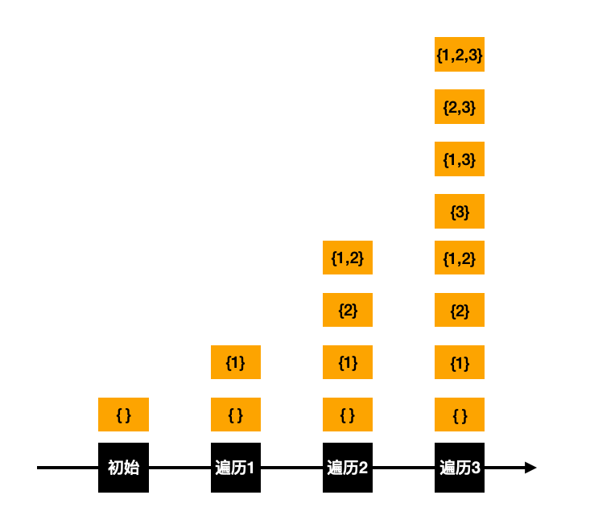

## 78 子集-中等

题目：

给你一个整数数组 `nums` ，数组中的元素 **互不相同** 。返回该数组所有可能的子集（幂集）。

解集 **不能** 包含重复的子集。你可以按 **任意顺序** 返回解集。


分析：因为其子集需要遍历所有可能，需要保留中间结果集。

算法：外层遍历当前元素；内层遍历结果集，取结果集+当前元素组成新的结果集，并追加到最终的结果集中。

```go
// date 2022/09/20
func subsets(nums []int) [][]int {
    // res表示结果集合
    res := make([][]int, 0, 1024)
    // 空集合也是一种结果，先追加进去
    res = append(res, []int{})
    for _, v := range nums {
        // 遍历当前的元素，取出之前的所有结果集，追加当前元素
        s := len(res)
        for i := 0; i < s; i++ {
            t := make([]int, 0)
            t = append(t, res[i]...)
            t = append(t, v)
            res = append(res, t)
        }
    }
    return res
}
```


算法图解：

