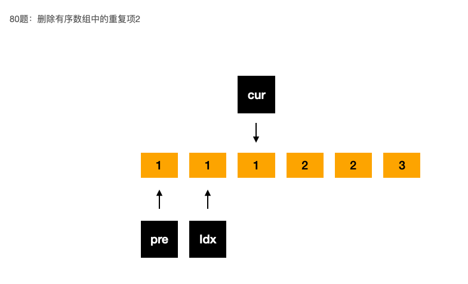

## 80 删除有序数组中的重复元素2-中等

题目：

给你一个有序数组 `nums` ，请你**[ 原地](http://baike.baidu.com/item/原地算法)** 删除重复出现的元素，使得出现次数超过两次的元素**只出现两次** ，返回删除后数组的新长度。

不要使用额外的数组空间，你必须在 **[原地 ](https://baike.baidu.com/item/原地算法)修改输入数组** 并在使用 O(1) 额外空间的条件下完成。


分析：

算法：双指针，idx指针负责维护目标结果的下标；cur指针负责遍历元素；另外需要额外保留一个指针pre，用于判断当前元素是否与前面第二个元素是否相等

```go
// date 2022/09/20
// cur 维护当前要检查的下标
// last 维护新数组的下标
// pre 维护新数组中 last 前一个的下标
func removeDuplicates(nums []int) int {
    size := len(nums)
    if size <= 2 {
        return size
    }
    cur, last, pre := 2, 1, 0
    for cur < size {
        if nums[cur] != nums[last] || nums[cur] != nums[pre] {
            pre = last
            last++
            nums[last] = nums[cur]
        }
        cur++
    }
    return last+1
}
```


算法图解：

