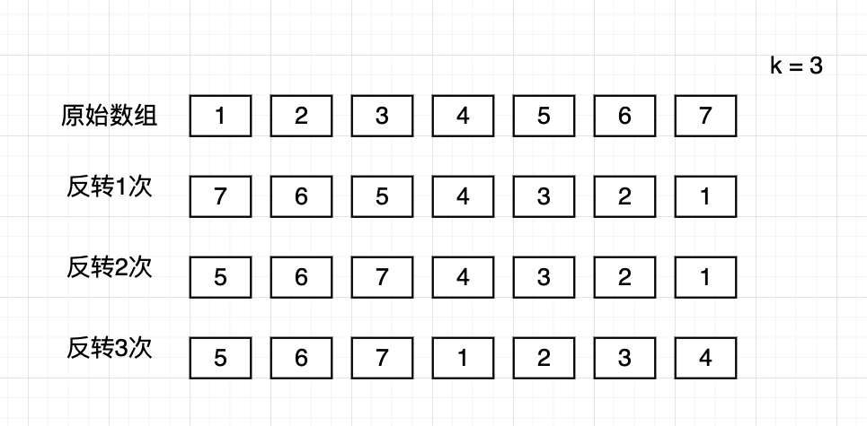

## 189 轮转数组-中等

题目：

给定一个数组，将数组中的元素向右移动K个位置，K是非负整数。


分析：【推荐该算法】

向右轮转 K 个位置，就是将数组的后 K 个元素放到数组的头部。那么，可以通过下面的方式得到：

1. 先整体反转数组
2. 再反转前 K-1 个元素，最后反转 后面的 n-k 个元素。

```go
// date 2022/09/22
func rotate(nums []int, k int)  {
    n := len(nums)
    k %= n
    reverse(nums, 0, n-1)
    reverse(nums, 0, k-1)
    reverse(nums, k, n-1)
}

func reverse(nums []int, left, right int) {
    for left < right {
        nums[left], nums[right] = nums[right], nums[left]
        left++
        right--
    }
}
```

算法图解：




其他算法：

暴力解法。时间复杂度O(n*k)，空间复杂度O(1)

先移动1步，再移动k步

```go
// date 2022/09/24
func rotate(nums []int, k int) {
	n := len(nums)
	k %= n
    for k > 0 {
        moveOneStep(nums)
        k--
    }
}

func moveOneStep(nums []int) {
    if len(nums) < 2 {
        return
    }
    n := len(nums)
    tail := nums[n-1]
    copy(nums[1:], nums[0:n-1])
    nums[0] = tail
}
```

算法图解：


