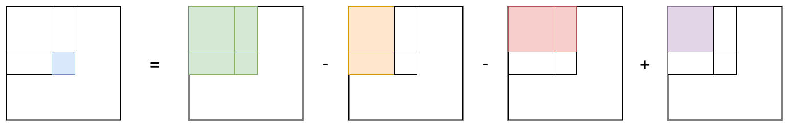

## 304 二维区域和检索-矩阵不可变-中等

题目：

给定一个二维矩阵 `matrix`，以下类型的多个请求：

- 计算其子矩形范围内元素的总和，该子矩阵的 **左上角** 为 `(row1, col1)` ，**右下角** 为 `(row2, col2)` 。

实现 `NumMatrix` 类：

- `NumMatrix(int[][] matrix)` 给定整数矩阵 `matrix` 进行初始化
- `int sumRegion(int row1, int col1, int row2, int col2)` 返回 **左上角** `(row1, col1)` 、**右下角** `(row2, col2)` 所描述的子矩阵的元素 **总和** 。


分析：



```go
// date 2023/12/12
type NumMatrix struct {
    preSum [][]int
}


func Constructor(matrix [][]int) NumMatrix {
    m := len(matrix)
    n := len(matrix[0])
    data := make([][]int, m+1)
    for i := 0; i <= m; i++ {
        data[i] = make([]int, n+1)
    }

    for i := 1; i <= m; i++ {
        for j := 1; j <= n; j++ {
            data[i][j] = data[i-1][j] + data[i][j-1] + matrix[i-1][j-1] - data[i-1][j-1]
        }
    }
    return NumMatrix{preSum: data}
}


func (this *NumMatrix) SumRegion(row1 int, col1 int, row2 int, col2 int) int {
    return this.preSum[row2+1][col2+1] - this.preSum[row1][col2+1] - this.preSum[row2+1][col1] + this.preSum[row1][col1]
}


/**
 * Your NumMatrix object will be instantiated and called as such:
 * obj := Constructor(matrix);
 * param_1 := obj.SumRegion(row1,col1,row2,col2);
 */
```

