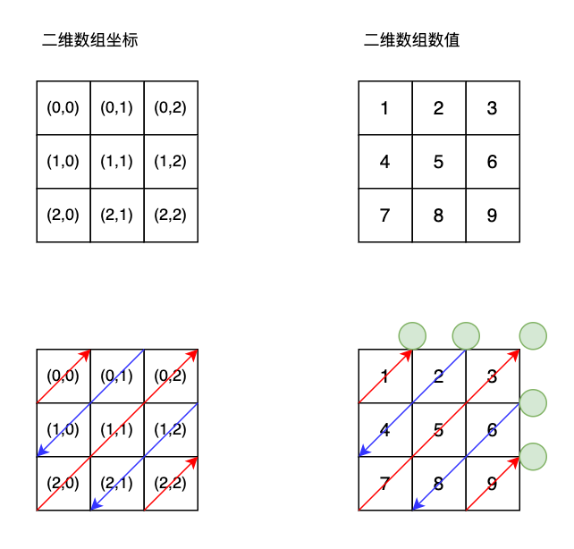

## 498 对角线遍历-中等

题目：

给定一个二维数组，返回其对角线遍历序列。


分析：

这种题目是细节题，通过寻找遍历的规律求解。

观察对角线遍历，有以下几个规律：

1. 总的遍历次数等于行数加上列数，减一；即`totalTravel = m+n-1`
2. 每次对角线遍历，横坐标和纵坐标的和是固定值，且等于当前的遍历次数。如果设横坐标为 x，纵坐标为 y，那么 x + y = travel。
3. 对角线遍历分为两种，自上而下，和自下而上；如果是自下而上，那么x--,y++；如果是自上而下，那么x++,y--。
4. 每次对角线遍历，x 如何确定。如果不超过边界，x 等于当前遍历次数，如果超过边界，取边界上限。
5. y 直接通过 i - x 得到。

```go
// date 2020/02/21
func findDiagonalOrder(mat [][]int) []int {
    res := make([]int, 0, 16)
    m := len(mat)
    n := len(mat[0])

    totalTravel := m+n-1
    // xtravel: bottom to up, x--, y++
    // ytravel: up to bottom, x++, y--
    xTravel := true
    xLimit, yLimit := 0, 0
    x, y := 0, 0

    for i := 0; i < totalTravel; i++ {
        if xTravel {
            xLimit = m
            yLimit = n
        } else {
            xLimit = n
            yLimit = m
        }
        
        if i < xLimit {
            x = i
        } else {
            x = xLimit-1
        }
        y = i - x  // 
        for x >= 0 && y < yLimit {
            if xTravel {
                res = append(res, mat[x][y])
            } else {
                res = append(res, mat[y][x])
            }
            x--
            y++
        }

        xTravel = !xTravel
    }
    return res
}
```


