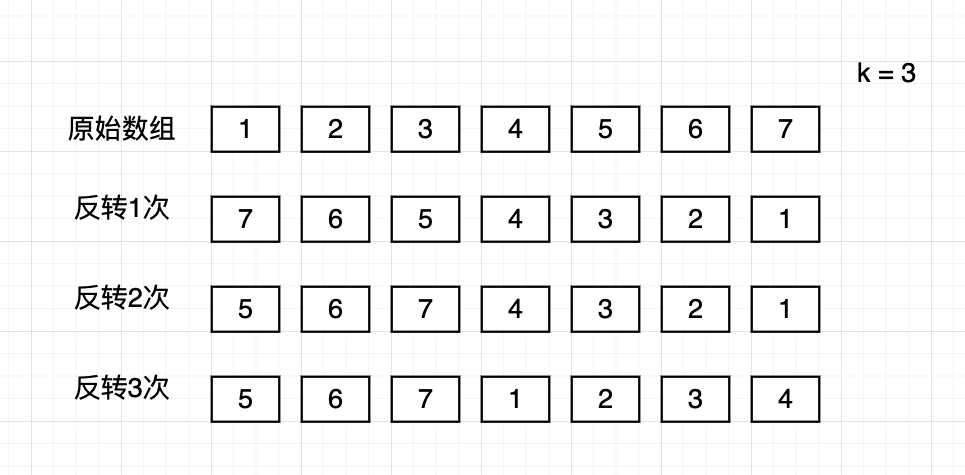

## 189 轮转数组

题目要求：给定一个数组，将数组中的元素向右移动K个位置，K是非负整数。

题目链接：https://leetcode.cn/problems/rotate-array/submissions/


算法分析：

算法1：暴力解法。时间复杂度O(n*k)，空间复杂度O(1)

先移动1步，再移动k步

```go
// date 2022/09/24
func rotate(nums []int, k int) {
	n := len(nums)
	k %= n
    for k > 0 {
        moveOneStep(nums)
        k--
    }
}

func moveOneStep(nums []int) {
    if len(nums) < 2 {
        return
    }
    n := len(nums)
    tail := nums[n-1]
    copy(nums[1:], nums[0:n-1])
    nums[0] = tail
}
```


算法2：

当我们旋转数组k次，k%n个尾部元素会移动到数组的头部，剩下的元素被向后移动。那么，先将数组整体反转一次，然后反转前k个元素，再反转后面的n-k个元素，即是想要的结果。

```go
// date 2022/09/24
func rotate(nums []int, k int) {
	n := len(nums)
	k %= n
	reverse(nums, 0, n-1)
	reverse(nums, 0, k-1)
	reverse(nums, k, n-1)
}

func reverse(nums []int, left, right int) {
	for left < right {
		nums[left], nums[right] = nums[right], nums[left]
		left++
		right--
	}
}
```


算法图解：


