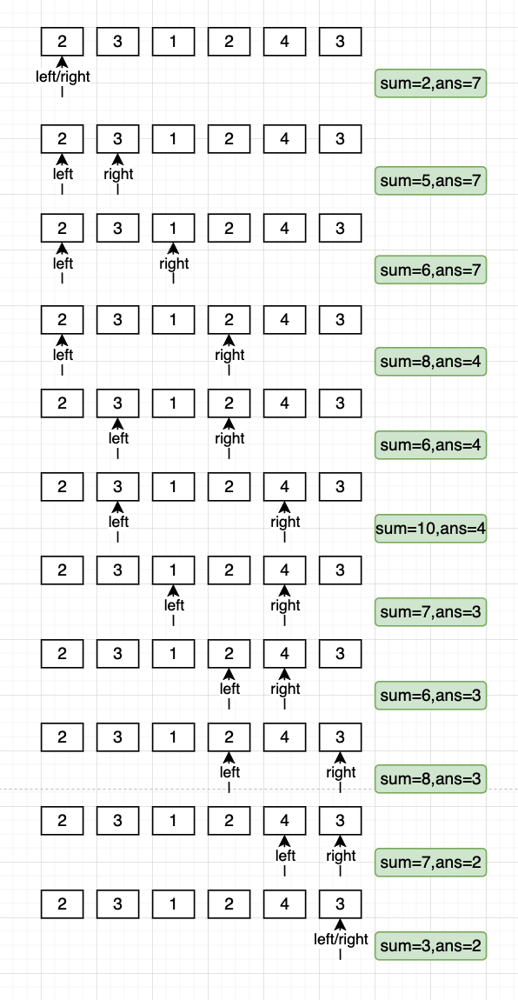

## 209 长度最小的子数组

题目要求：给定一个含有n个正整数的数组和一个正整数target。找出数组中满足其和大小等于目标数的长度最小的连续子数组，并返回起长度，否则返回0。

题目链接：https://leetcode.cn/problems/minimum-size-subarray-sum/


算法分析：滑动窗口，左右指针

定义left, right表示左右指针，即滑动窗口的边界；sum为滑动窗口元素的总和；`sum=nums[left, right]`

初始状态：left, right为0, sum也为0；

每一次迭代将nums[right]计入总和，如果`sum>=target`，则更新子数组的长度，此时长度为`right-left+1`；

然后将`nums[left]`从sum中减去；并将left右移，如果`sum >= target`更新子数组长度，直到`sum < target`。


```go
// date 2022/09/24
func minSubArrayLen(target int, nums []int) int {
	n := len(nums)
	left, right, sum := 0, 0, 0
	res := n + 1
	for right < n {
		sum += nums[right]
		for sum >= target {
			res = min(res, right-left+1)
			sum -= nums[left]
			left++
		}
		right++
	}

	if res == n+1 {
		return 0
	}
	return res
}

func min(x, y int) int {
	if x < y {
		return x
	}
	return y
}
```


算法图解


