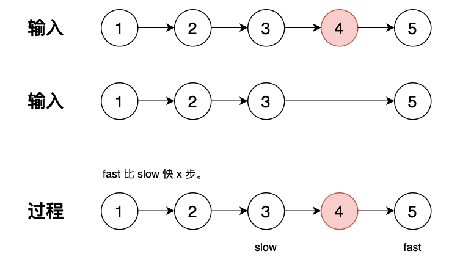

## 19 删除链表的倒数第N个结点-中等

题目：

给你一个链表，删除链表的**倒数**第 `n` 个结点，并且返回链表的头结点。


分析：快慢指针

双指针slow和fast，fast快指针先走n步(n有效，所以最坏的情况是快指针走到表尾，即是删除表头元素)；然后slow指针和fast指针同走，当fast指针走到最后一个元素时，因为slow与fast慢指针差n步，slow刚好为欲删除节点的前驱节点。

```go
// date 2023/10/11
/**
 * Definition for singly-linked list.
 * type ListNode struct {
 *     Val int
 *     Next *ListNode
 * }
 */
func removeNthFromEnd(head *ListNode, n int) *ListNode {
    if head == nil {
        return head
    }
    slow, fast := head, head
    for n > 0 && fast != nil {
        fast = fast.Next
        n--
    }
    // 到这里，我们期望 n 为零，表示链表中存在要删除的点
    // 如果 n > 0 表示已经超出要删除的点了，直接返回 head
    if n > 0 {
        return head
    }
    // n 为零，如果 fast 为空 表示要删除 头节点
    if fast == nil {
        // delete the head
        return head.Next
    }

    for fast.Next != nil {
        slow, fast = slow.Next, fast.Next
    }
    slow.Next = slow.Next.Next
    return head
}
```


