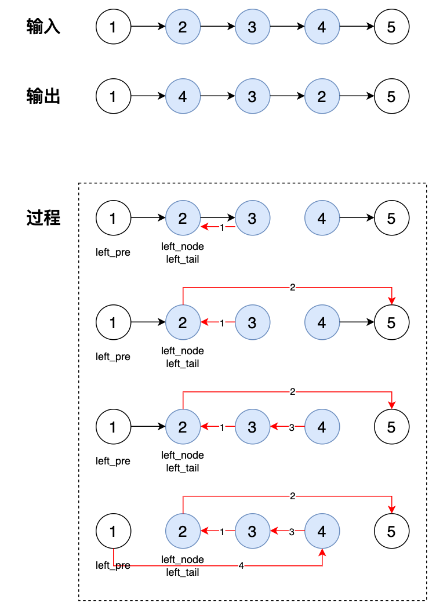

## No.092 反转链表2

题目：

给你单链表的头指针 head 和两个整数 left, right，其中 left <= right。请你反转从位置 left 到 位置 right 的链表节点，返回反转后的链表。


分析：

使用一趟扫描，在扫描过程中：

1. 先找到 left 及其前驱节点 leftpre，并保存
2. 同时将 left 节点保存为 lefttail，继续遍历，并反转 [left, right] 中的节点
3. 找到 right 节点之后，更新 left, right 节点的Next值
4. 确定新的 head

```go
// date 2023/10/11
/**
 * Definition for singly-linked list.
 * type ListNode struct {
 *     Val int
 *     Next *ListNode
 * }
 */
func reverseBetween(head *ListNode, left int, right int) *ListNode {
    if head == nil || head.Next == nil || left >= right {
        return head
    }
    var lpre, lnode, ltail *ListNode
    pre := head
    // find the left node and the pre of left node 
    for left > 1 && pre != nil {
        lpre = pre
        pre = pre.Next
        left--
        right--
    }
    // for left = right = n
    if pre == nil {
        return head
    }
    // save left node
    lnode = pre
    // save tail for new list [left, right]
    ltail = pre
    
    // find the right node and the post of right node
    pre = pre.Next
    right--
    for right > 1 && pre != nil {
        after := pre.Next
        pre.Next = ltail
        ltail = pre
        pre = after
        right--
    }
    // update left node point to post of right
    lnode.Next = pre.Next
    // update right node point to left tail
    pre.Next = ltail

    // left = 1, the new head is orginal right node
    if lpre == nil {
        head = pre
    } else {
        lpre.Next = pre
    }
    return head
}
```



