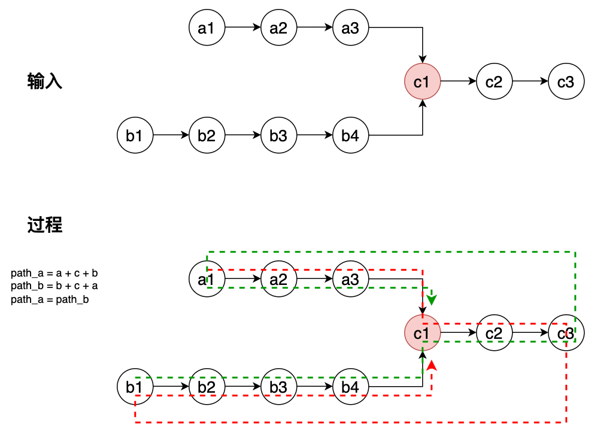

## 160 相交链表-简单

题目：

给你两个链表的头节点 headA 和 headB，请你找出并返回两个链表相交的节点。如果不存在相交节点，则返回 nil。


分析：

一句话，我曾走过你曾走过的路。

一开始 a，b 指针分别从各自头指针开始走，等走到尾部的时候，a 指针在从 headB 开始走，b 指针则从 headA 开始走，a,b 指针相等的时候就是 相交的起点。

```go 
// date 2023/10/11
/**
 * Definition for singly-linked list.
 * type ListNode struct {
 *     Val int
 *     Next *ListNode
 * }
 */
func getIntersectionNode(headA, headB *ListNode) *ListNode {
    if headA == nil || headB == nil { return nil }
    pa, pb := headA, headB
    
    for pa != pb {
        pa, pb = pa.Next, pb.Next
        if pa == nil && pb == nil {
            return nil
        }
        if pa == nil {
            pa = headB
        }
        if pb == nil {
            pb = headA
        }
    }
    return pa
}
```

