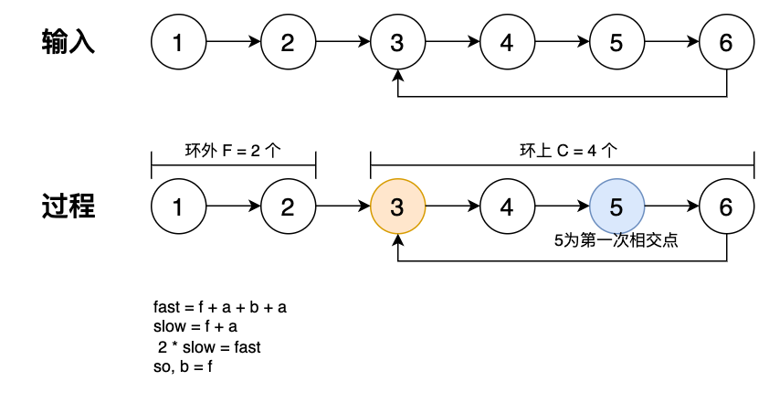

## 142 环形链表2

题目：

> 给定一个链表的头节点  head ，返回链表开始入环的第一个节点。 如果链表无环，则返回 null。
>
> 如果链表中有某个节点，可以通过连续跟踪 next 指针再次到达，则链表中存在环。 为了表示给定链表中的环，评测系统内部使用整数 pos 来表示链表尾连接到链表中的位置（索引从 0 开始）。如果 pos 是 -1，则在该链表中没有环。注意：pos 不作为参数进行传递，仅仅是为了标识链表的实际情况。
>
> 不允许修改 链表。
>
> 来源：力扣（LeetCode）
> 链接：https://leetcode.cn/problems/linked-list-cycle-ii
> 著作权归领扣网络所有。商业转载请联系官方授权，非商业转载请注明出处。


分析：

推荐算法2。

```go
// 算法1：利用额外空间，时间复杂度和空间复杂度均为O(n)
func detectCycle(head *ListNode) *ListNode {
  visited := make(map[*ListNode]struct{})
  for head != nil {
    if _, ok := visited[head]; ok {
      return head
    }
    visited[head] = struct{}{}
    head = head.Next
  }
  return nil
}
// date 2023/10/11
// 算法2：Floyd算法
/*
假设：环外有F个元素，环上C个元素
快慢指针判断是否有相遇，相遇(h节点)时，快指多走一个环【F+a+b+a】；慢指针走了【F+a】；因为2(F+a) = F+a+b+a,所以f=b
因此，相遇节点和头节点同时走f步，即是环的入口
*/
func detectCycle(head *ListNode) *ListNode {
  slow, fast := head, head
  for fast != nil && fast.Next != nil {
    slow, fast = slow.Next, fast.Next.Next
    if slow == fast {
      break
    }
  }
  if fast == nil || fast.Next == nil {return nil}
  fast = head
  for fast != slow {
    slow, fast = slow.Next, fast.Next
  }
  return fast
}
```


