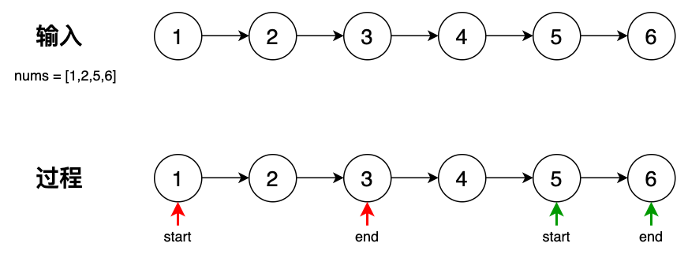

## 817 链表组件-中等

题目：

给定链表的头节点 head，该链表上的每个结点都有一个唯一的整型值。同时给定列表 nums，该列表是上述链表中整型值的一个子集。

返回列表 nums 中组件的个数。组件的定义为：链表中一段最长连续结点的值（该值必须在列表 nums 中）构成的集合。


分析：

这个题目主要在于理解题意，理解以后就会发现跟「求最长连续子序列的个数」类似。所以解法就是中规中矩的 快慢指针 或者 滑动窗口。

1. 找到第一个 start 点，如果找不到，直接返回 0
2. 有了 start，遍历链表，开始寻找 end（即第一个不在列表中的点），这样区间 [start, end) 就形成了一个解，结果集+1
3. 然后重复 1,2

```go
// date 2023/10/12
/**
 * Definition for singly-linked list.
 * type ListNode struct {
 *     Val int
 *     Next *ListNode
 * }
 */
func numComponents(head *ListNode, nums []int) int {
    set := make(map[int]struct{}, 1024)
    for _, v := range nums {
        set[v] = struct{}{}
    }
    
    var start, end *ListNode
    var res int
    // find the start
    for head != nil {
        _, ok := set[head.Val]
        if !ok {
            head = head.Next
        } else {
            start = head
            break
        }
    }
    // 说明没有找到，直接返回
    if start == nil {
        return 0
    }
    // 开始寻找可能的解
    // [start, end)
    end = start
    for end != nil {
        for end != nil && end.Next != nil {
            _, ok := set[end.Val]
            if ok {
                end = end.Next
            } else {
                // 找到了，此时区间[start, end) 就是一个解
                break
            }
        }
        // 判断是否为 尾节点
        if end.Next == nil { // the tail
            res++
            break
        }
        res++
        start = end
        // 重新寻找 start
        for start != nil {
            _, ok := set[start.Val]
            if !ok {
                start = start.Next
            } else {
                end = start
                break
            }
        }
        if start == nil {
            break
        }
    }
    return res
}
```




====

下面的代码是一样的思路，只是在一个循环中搞定，需要考虑的边界的条件更多，可读性反而不如上面的写法，不推荐。

```go
/**
 * Definition for singly-linked list.
 * type ListNode struct {
 *     Val int
 *     Next *ListNode
 * }
 */
func numComponents(head *ListNode, nums []int) int {
    set := make(map[int]struct{}, 1024)
    for _, v := range nums {
        set[v] = struct{}{}
    }
    
    var start, end *ListNode
    var res int

    end = head
    for end != nil {
        // find the start
        for end != nil && end.Next != nil {
            _, ok := set[end.Val]
            if ok {
                start = end
                break
            } else {
                end = end.Next
            }
        }
        // 这说明走到的最后一个节点
        // 如果 start 为空，且 最后一个节点在列表中，那么这是一个解 res++
        // 如果 start 不为空，这时候只要 start != end，那么就是一个解 res++
        if end.Next == nil {
            // the tail node
            _, ok := set[end.Val]
            if start == nil && ok {
                res++
            } else if start != nil && start != end {
                res++
            }
            break
        }
        // 更新 start 节点
        start = end
        // find the end
        end = end.Next
        for end != nil {
            _, ok := set[end.Val]
            if ok {
                end = end.Next
            } else {
                // [start, end) is one of result
                res++
                start = nil
                break
            }
        }
        // the tail node
        if end == nil {
            res++
        }
    }

    return res
}
```

