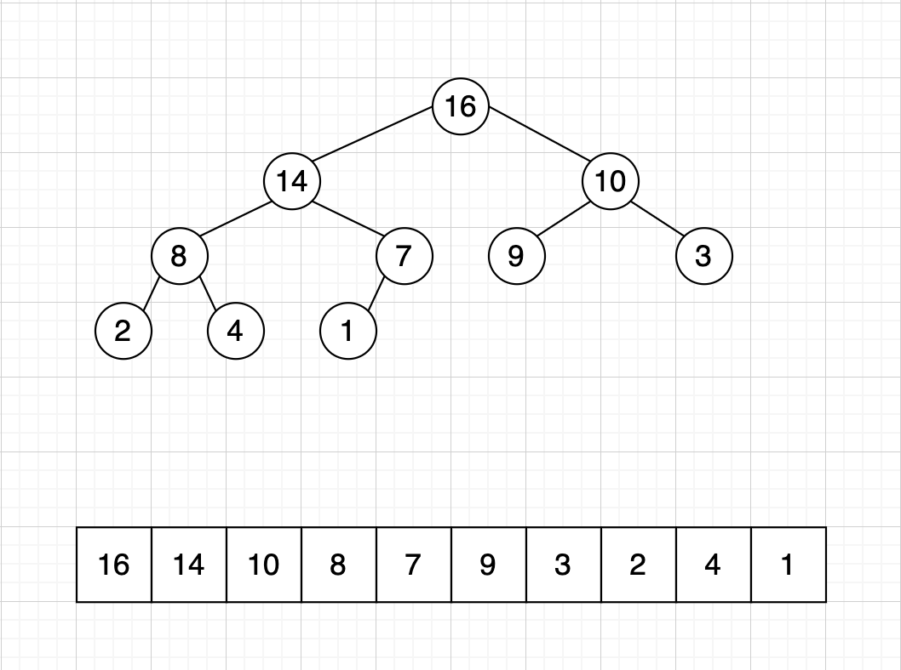

## 堆

### 堆的定义



（二叉）堆是一个数组，每个元素都保证 **大于等于** 或者 **小于等于** 另两个特定位置的元素。

数据结构二叉堆能够很好地实现有线队列的基本操作。

> 当一棵二叉树的每个结点都大于等于它的两个子结点时，它被称为堆有序。

二叉堆是一组能够用堆有序的完全二叉树排序的元素，并在数组中按照层级存储。

对于任意结点i，那么`i`对应的左右子结点分别为`2i+1`和`2i+2`，结点`i`对应的父结点为`i/2 -1`。

最大堆：即父结点>=子结点

最小堆：即父结点<=子结点

堆排序的时间复杂度为O(nlogn)

### 堆的特点

1. 可以在O(nlogn)时间复杂度内，向堆插入元素
2. 可以在O(nlogn)时间复杂度内，向堆删除元素
3. 可以在O(1)时间复杂度内，取得最值

### 堆的算法

堆的操作会首先进行一些简单的改动，打破堆的状态，然后再遍历堆并按照要求将堆的状态恢复，这个过程称为堆的有序化(reheapifying)。

堆的有序化有两种策略，分别是自下而上的堆有序化（上浮，swim）和自上而下的堆有序化（下沉，sink），其伪代码分别如下：

```go
// date 2020/03/01
// 自下而上swim
func swim(k int) {
  for k > 1 && less(k/2, i) {
    swap(k/2, k)
    k = k / 2
  }
}
// 自上而下sink
func sink(k int) {
  l := 2 * k    // 左节点
  r := l + 1    // 右节点
  for l < n {
 		r = l + 1
    if r < n && less(l, r) { l++ }
    if !less(k, l) { break }
    swap(k, l)
    k = l
    l = 2 * k
  }
}
```

**插入元素**

将新元素插入到数组的末尾，并使用自下而上的堆有序化将新元素上浮到合适的位置。时间复杂度O(logN)

**删除元素**

将数组顶端的元素删除，将数组最后一个元素放到顶端，并使用自上而下的堆有序化将这个元素下沉到合适的位置。时间复杂度O(logN)

### 堆排序

基本思路：先构造堆，然后将堆顶元素与数组的最后一个元素交换，然后对N-1的堆重新堆有序化。伪代码如下：

```go
// date 2020/03/01
func heapSort(nums []int) []int {
  makeMaxHeap(nums)
  n := len(nums)
  for n > 0 {
    swap(nums, 0, n-1)
    n--
    sink(nums, 0, n)
  }
}

// 构造堆
func makeMaxHeap(nums []int) {
  for i := len(nums) >> 1 - 1; i >= 0; i-- { sink(nums, 0, len(nums)) }
}

func sink(nums []int, start, end int) {
  if start > end { return }
  l := start >> 1 + 1
  temp := nums[start]
  for l < end {
    r := l + 1
    if r < end && nums[r] > nums[l] { l++ }
    if nums[start] > nums[l] { break }
    nums[start] = nums[l]
    nums[l] = temp
    start = l
    l = start >> 1 + 1
  }
}
```

### 相关题目

- 912 排序数组【M】
- 1046 最后一块石头的重量
- 215 数组中第K个最大元素
- 面试题40 最小的K个数
- 面试题17.09 第K个数

#### 912 排序数组

题目要求：https://leetcode-cn.com/problems/sort-an-array/

思路分析：

算法一：堆排序。时间复杂度O(NlogN)。

> 将N个元素排序，堆排序只需少于（2NlgN+2N）次比较，以及一半次数的交换。

```go
// date 2020/03/01
func sortArray(nums []int) []int {
    makeMaxHeap(nums)
    n := len(nums)
    for n > 0 {
        swap(nums, 0, n-1)
        n--
        maxHeapify(nums, 0, n)
    }
    return nums
}
// 堆排序
// 构建大顶堆
func makeMaxHeap(nums []int) {
    for i := len(nums) >> 1 - 1; i >= 0; i-- {
        maxHeapify(nums, i, len(nums))
    }
}
// 自上而下的堆有序化
func maxHeapify(nums []int, start, end int) {
    if start > end { return }
    temp, l, r := nums[start], start << 1 + 1, start << 1 + 2
    for l < end {
        r = l + 1
        if r < end && nums[r] > nums[l] { l++ }
        if nums[start] > nums[l] { break }
        nums[start] = nums[l]
        nums[l] = temp
        start = l
        l = start << 1 + 1
    }
} 
// swap
func swap(nums []int, i, j int) {
    t := nums[i]
    nums[i] = nums[j]
    nums[j] = t
}
```


#### 1046 最后一块石头的重量

题目要求：https://leetcode-cn.com/problems/last-stone-weight/

思路分析：

```go
// date 2020/02/29
func lastStoneWeight(stones []int) int {
    if len(stones) == 1 { return stones[0] }
    sort.Ints(stones)
    n := len(stones)
    for stones[n-2] != 0 {
        stones[n-1] -= stones[n-2]
        stones[n-2] = 0
        sort.Ints(stones)
    }
    return stones[n-1]
}
```

#### 面试题40 最小的k个数

题目要求：https://leetcode-cn.com/problems/zui-xiao-de-kge-shu-lcof/

思路分析：

1）注意边界条件k等于零

2）建立大顶堆的结果集

3）遍历数组，如果小于堆顶元素，则替换，并调整堆

```go
// date 2020/02/29
func getLeastNumbers(arr []int, k int) []int {
  if k == 0 { return []int{} }
  res, size := make([]int, k), 0
  for _, v := range arr {
    if size < k {
      res[size] = v
      size++
      if size == k {
        makeMaxHeap(res)
      }
    } else if v < res[0] {
      res[0] = v
      maxHeapify(res, 0)
    }
  }
  return res
}
// 实现大顶堆的两个函数
func makeMaxHeap(nums []int) {
  for i := len(nums) >> 1 - 1; i >= 0; i-- {
    maxHeapify(nums, i)
  }
}
func maxHeapify(nums []int, i int) {
  if i > len(nums) { return }
  temp, n := nums[i], len(nums)
  l, r := i << 1 + 1, i << 1 + 2
  for l < n {
    r = l+1
    if r < n && nums[r] > nums[l] { l++ }
    if nums[i] > nums[l] { break }
    nums[i] = nums[l]
    nums[l] = temp
    i = l
    l = i << 1 + 1
  }
}
```

#### 面试题17.09 第k个数

题目要求：https://leetcode-cn.com/problems/get-kth-magic-number-lcci/

思路分析：动态规划

```go
// date 2020/02/29
func getKthMagicNumber(k int) int {
  l1, l2, l3 := 0, 0, 0
  res := make([]int, k)
  res[0] = 1
  for i := 1; i < k; i++ {
    res[i] = min(res[l1] * 3, min(res[l2] * 5, res[l3] * 7))
    if res[i] == res[l1] * 3 { l1++ }
    if res[i] == res[l2] * 5 { l2++ }
    if res[i] == res[l3] * 7 { l3++ }
  }
  return res[k-1]
}

func min(x, y int) int {
  if x < y { return x }
  return y
}
```

