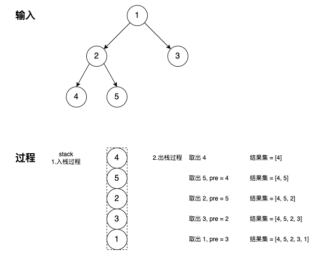

## 二叉树

[TOC]

### 1.什么是二叉树

​	树是一种数据结构，树中的每个节点都包含一个键值和所有子节点的列表，对于二叉树来说，每个节点最多有两个子树结构，分别称为左子树和右子树。

#### 二叉树的深度

​	二叉树的深度是指二叉树的根结点到叶子结点的距离。

​	最大深度 = 根结点到叶子结点的最大距离

​	最小深度 = 根结点到叶子结点的最小距离。

​	常见的问题包括求二叉树的最大/最小深度，一般可以使用递归算法，或者自顶向下的 DFS。

参见题目：

- 104—二叉树的最大深度
- 110—平衡二叉树，自底向上的 DFS
- 111—二叉树的最小深度


### 2.二叉树的遍历

按照 root 节点的访问顺序，可分为前序遍历，中序遍历和后序遍历。其顺序如下：

- 前序遍历：按「根-左-右」依次访问各节点
- 中序遍历：按「左-根-右」依次访问各节点
- 后序遍历：按「左-右-根」依次访问各节点


递归版本的遍历，只要理解其思想就很好写；而对于非递归版本的遍历，需要深入理解其结点的遍历顺序，并记录下来之前经过的结点，所以一定会用到栈。

层序遍历是一种特殊的遍历，从二叉树的深度来理解就是，将同一深度的结果按照从左到右的顺序形成一个数组，不同深度的结果再放到另一个数组里面，最终形成一个二维数组。

从广度搜索和深度搜索的角度来讲，层序遍历属于广度优先搜索，而前序，中序，后序遍历均为深度优先搜索。


除了以上遍历顺序，在实际解题过程中，根据访问「根左右」的前后顺序，可以灵活使用。比如题目【1038 从二叉搜索树到更大和树】就用到了「右-根-左」的遍历顺序。


参见题目

- 094—二叉树的中序遍历
- 098—验证二叉搜索树，迭代中序遍历判断是否符合递增
- 099—恢复二叉搜索树，中序遍历找到被交换的两个节点
- 102—二叉树的层序遍历
- 
- 145—二叉树的后序遍历


#### 2.1 前序遍历

参见题目：

- 144—二叉树的前序遍历
- 105—从前序和中序遍历序列构造二叉树


#### 2.2 中序遍历

这里跟前序遍历类似，只是取根节点值加入结果集的时机略有区别。

其主要思路为：

1. 持续检查其左子树，重复1，直到左子树为空【此时栈中保留的是一系列的左子树节点】
2. 出栈一次，并取根节点值加入结果集，然后检查最后一个左子树的右子树，重复1,2

```go
// 迭代版
// 需要stack结构
// left->root->right
func inorderTraversal(root *TreeNode) []int {
    if root == nil {
        return []int{}
    }
    stack := make([]*TreeNode, 0, 16)
    res := make([]int, 0, 16)
    for root != nil || len(stack) != 0 {
        for root != nil {
            stack = append(stack, root)
            root = root.Left
        }
        if len(stack) != 0 {
            root = stack[len(stack)-1]
            stack = stack[:len(stack)-1]
            res = append(res, root.Val)
            root = root.Right
        }
    }
    return res
}
```

参见题目：

- 106—从中序和后序遍历序列构造二叉树
- 538—把二叉搜索树转换为累加树，递归中序遍历解法
- 783—二叉搜索树节点最小距离，递归中序遍历


#### 2.3 后序遍历

后序遍历的迭代算法依然需要 stack 结构来保存已经遍历过的节点；同时借助 pre 指针保存上次出栈的节点，用于判断当前节点是否同时具有左右子树，还是只有单个子树。

1. 先将根节点入栈，循环遍历栈是否为空
2. 出栈，取出当前节点
   1. 如果当前节点没有左右子树，则为叶子节点，直接加入结果集
   2. 其次判断上次出栈的节点是否是当前节点的左右子树，如果是，表明当前节点的子树已经处理完毕，也需要加入结果集【这里依赖的是左右子树的入栈，因为在栈中左右子树不具备前继关系，只有根节点具备】
   3. 依次检查当前节点的右子树，左子树，重复1,2

```go
// 迭代版
// left->right-root
func postorderTraversal(root *TreeNode) []int {
    if root == nil {return nil}
    res := make([]int, 0)
    stack := make([]*TreeNode, 0)
    stack = append(stack, root)
    var pre, cur *TreeNode   // 记录前驱节点和当前节点
    for len(stack) != 0 {
        // 出栈 当前结点
        cur = stack[len(stack)-1]
        // 如果当前结点为叶子结点，则直接加入结果集
        // 如果当前结点不是叶子结点，但是上次遍历结点为当前结点的左右子树时(说明当前结点只有单个子树，且子树已经处理完毕)，也加入结果集
        if cur.Left == nil && cur.Right ==  nil || pre != nil && (pre == cur.Left || pre == cur.Right) {
            res = append(res, cur.Val)
            // 出栈，继续检查
            stack = stack[:len(stack)-1]
            pre = cur
        } else {
            // 因为在出栈的时候检查结点，并追加到结果中
            // 所以，先入栈右子树，后入栈左子树
            if cur.Right != nil {
                stack = append(stack, cur.Right)
            }
            if cur.Left != nil {
                stack = append(stack, cur.Left)
            }
        }
    }
    
    return res
}
```




参见题目：

- 145—二叉树的后续遍历
- 106—从中序和后序遍历序列构造二叉树


#### 2.4 层序遍历

层序遍历是指逐层遍历树的结构，也称为广度优先搜索，算法从一个根节点开始，先访问根节点，然后遍历其相邻的节点，其次遍历它的二级、三级节点。

借助队列数据结构，先入先出的顺序，实现层序遍历。

```go
// date 2020/03/21
// 层序遍历
// bfs广度优先搜索
// 算法一：使用队列，逐层遍历
func levelOrder(root *TreeNode) [][]int {
    if root == nil {
        return [][]int{}
    }
    res := make([][]int, 0, 16)
    queue := make([]*TreeNode, 0, 16)
    queue = append(queue, root)
    for len(queue) != 0 {
        n := len(queue)
        curRes := make([]int, 0, 16)
        for i := 0; i < n; i++ {
            cur := queue[i]
            curRes = append(curRes, cur.Val)
            if cur.Left != nil {
                queue = append(queue, cur.Left)
            }
            if cur.Right != nil {
                queue = append(queue, cur.Right)
            }
        }
        res = append(res, curRes)
        queue = queue[n:]
    }
    return res
}
```

算法2：DFS 深度优先搜索

这里的思路类似求二叉树的最大深度，借助dfs搜索，在每一层追加结果。

```go
// date 2020/03/21
func levelOrder(root *TreeNode) [][]int {
    res := make([][]int, 0, 16)
    var dfs func(root *TreeNode, level int)
    dfs = func(root *TreeNode, level int) {
        if root == nil {
            return
        }
        if len(res) == level {
            res = append(res, make([]int, 0, 4))
        }
        res[level] = append(res[level], root.Val)
        level++
        dfs(root.Left, level)
        dfs(root.Right, level)
    }
    dfs(root, 0)
    return res
}
```

**注意**，从上面两种实现的方式来看，层序遍历既可以使用广度优先搜索，也可以使用深度优先搜索。

参见题目

- 102—二叉树的层序遍历
- 103—二叉树的锯齿形层序遍历，奇偶层反转
- 107—二叉树的层序遍历2，将底部结果放到开头，没有新意
- 199—二叉树的右视图，取层序遍历最后一个节点
- 404—左叶子之和
- 590—N 叉树的后序遍历，迭代的层序遍历解法
- 987—二叉树的垂序遍历，层序遍历，每个节点标注坐标，根据坐标排序


### 3.递归解决树的问题

递归通常是解决树的相关问题最有效和最常用的方法之一，分为**自顶向下**和**自底向上**两种。

**自顶向下**的解决方案

自顶向下意味着在每个递归层级，需要先计算一些值，然后递归调用并将这些值传递给子节点，视为**前序遍历**。参见题目【二叉树的最大深度】

```go
// 通用的框架，自顶向下
1. return specific value for null node
2. update the answer if needed                      // answer <-- params
3. left_ans = top_down(root.left, left_params)      // left_params <-- root.val, params
4. right_ans = top_down(root.right, right_params)   // right_params <-- root.val, params 
5. return the answer if needed                      // answer <-- left_ans, right_ans
```

参见题目

- 95—不同的二叉搜索数2，生成所有的二叉搜索数
- 113—路径总和2，求满足条件的所有路径，DFS
- 129—求根节点到叶子节点数字之和，携带已知内容递归到叶子节点
- 257—二叉树的所有路径，与求路径和2一样的解法
- 1161 最大层内元素和，层序遍历，求和，求最大，无新意


**自底向上**的解决方案

自底向上意味着在每个递归层级，需要先对子节点递归调用函数，然后根据返回值和根节点本身得到答案，视为**后序遍历**。

```go
// 通用的框架，自底向上
1. return specific value for null node
2. left_ans = bottom_up(root.left)          // call function recursively for left child
3. right_ans = bottom_up(root.right)        // call function recursively for right child
4. return answers                           // answer <-- left_ans, right_ans, root.val
```

参见题目：

- 543—二叉树的直径，求左右深度之和。
- 865—具有所有最深节点的最小子树


**小结**：

当遇到树的问题时，先思考一下两个问题：

> 1.你能确定一些参数，从该节点自身解决出发寻找答案吗？
>
> 2.你可以使用这些参数和节点本身的值来决定什么应该是传递给它子节点的参数吗？

如果答案是肯定的，那么可以尝试使用自顶向下的递归来解决问题。

当然也可以这样思考：

> 对于树中的任意一个节点，如果你知道它子节点的结果，你能计算出该节点的答案吗？

如果答案是肯定的，可以尝试使用自底向上的递归来解决问题。


### 深度优先搜索

深度优先搜索的过程，过程中计算最终的结果集，和深搜本身的返回值不一致。这并不矛盾。反而，有些题目更好使。参见题目979-在二叉树中分配硬币。

参见题目：

- 979—在二叉树中分配硬币，DFS 并返回左右子树的需要硬币的差值


### 广度优先搜索


### 4 平衡二叉树

一棵高度平衡二叉树的定义为:

> 一个二叉树每个节点 的左右两个子树的高度差的绝对值不超过1。

参见题目：

- 108—将有序数组转换为二叉搜索树，递归实现
- 110—平衡二叉树，DFS 求每个子树的深度，并比较


### 5 对称二叉树

如果一棵二叉树关于根结点左右对称，则称为对称二叉树，也称为镜像二叉树。

参见题目：

- 101—对称二叉树，递归，或者迭代两个树

