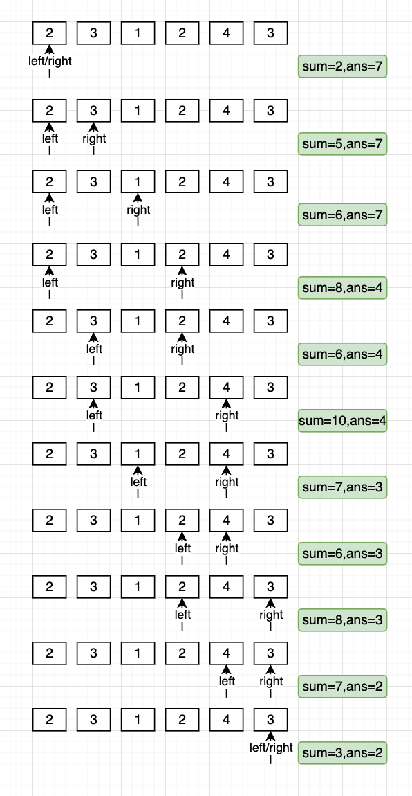

## 209 长度最小的子数组-中等

题目要求：给定一个含有n个正整数的数组和一个正整数target。找出数组中满足其和大小等于目标数的长度最小的连续子数组，并返回起长度，否则返回0。

题目链接：https://leetcode.cn/problems/minimum-size-subarray-sum/


算法分析：滑动窗口，左右指针

定义left, right表示左右指针，即滑动窗口的边界；sum为滑动窗口元素的总和；`sum=nums[left, right]`

初始状态：left, right为0, sum也为0；

每一次迭代将nums[right]计入总和，如果`sum>=target`，则更新子数组的长度，此时长度为`right-left+1`；

然后将`nums[left]`从sum中减去；并将left右移，如果`sum >= target`更新子数组长度，直到`sum < target`。


```go
// date 2022/09/24
func minSubArrayLen(target int, nums []int) int {
    left, right := 0, 0
    sum := 0
    size := len(nums)
    ans := size+1
    for right < len(nums) {
        sum += nums[right]
        right++
        for sum >= target {
            if ans > right - left {
                ans = right - left
            }

            sum -= nums[left]
            left++
        }
    }

    if ans == size + 1 {
        return 0
    }

    return ans
}
```


算法图解


