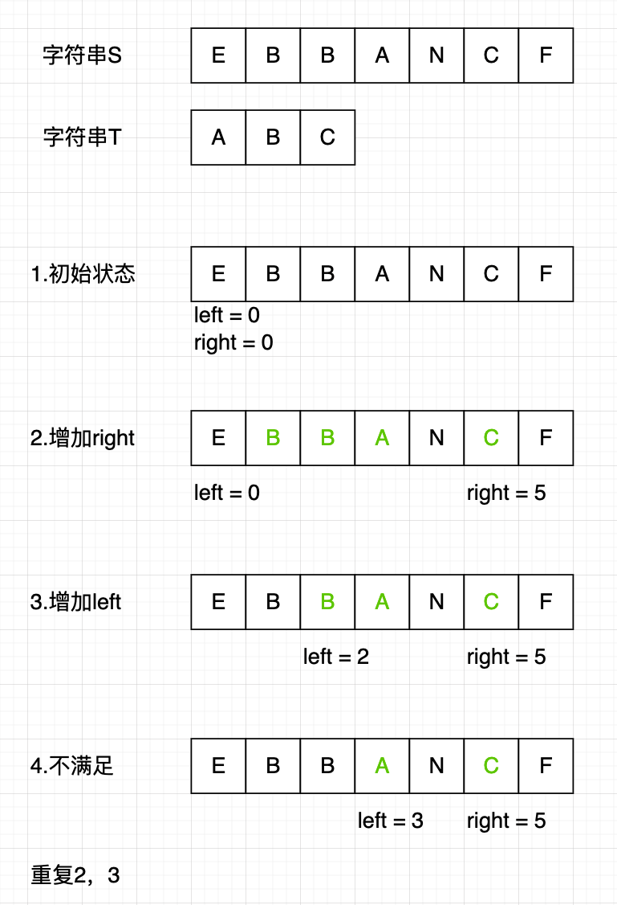

## 滑动窗口算法

当我们说滑动窗口时，其实有两层含义：

1. **滑动**：表示说这个窗口是移动的，按照一定的方向来移动
2. **窗口**：窗口的大小并不是固定的，可以不断地扩大窗口直到满足一定的条件；也可以不断地缩小，直到找到一个满足条件的最小值；也可以是固定大小


### 解题思路

滑动窗口算法的基本思路是这样的：

我们以这样的题目为例：给定两个字符串 `S` 和 `T`，求字符串 `S` 中包含 `T` 所有字符串的最小子字符串长度。

1. 首先我们使用双指针技巧，初始化 `left = right = 0`，将索引闭区间`[left, right]`成为一个 「窗口」
2. 不断地增加 `right` 指针，扩大窗口，直到窗口中元素全部满足条件，即包含所有 `T` 中元素
3. 此时停止增加 `right` ，而要开始增加 `left` 指针，缩小窗口，直到窗口不满足条件，即不包含 `T` 中的字符串
4. 重复第 2 和 第 3 步，直到 `right` 到达数组或者字符串的边界。




综合上面的介绍，对于非固定大小的窗口，伪代码可以这样写：

```go
func foo() {
  left, right := 0, 0
  n := len(nums)
  // 构造窗口
  for right < n {
    window.add(nums[right])
    right++
    for (window 不满足条件) {
      // 现在已经是一个窗口了，可以做一些事情
      // 一般用于求最小值
      left++
    }
  }
}
```

而对于固定大小的窗口，可以这样写：

```go
// 假设窗口固定大小为k
func windowWithSize() {
  left, right := 0, 0
  n := len(nums)
  for right < n {
    window.add(nums[right])
    right++
    if right - left >= k {
      // 现在已经是一个窗口了
      // 递增left, 移除最左边的元素
      // 移除时 需要做一些判断
      left++
    } 
  }
}
```


### 相关题目：

1. No.239 滑动窗口最大值
   1. 固定窗口大小，维护最大值列表
2. 
