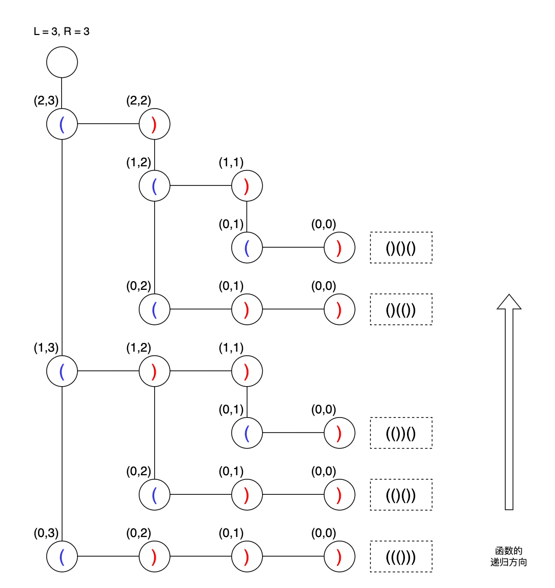

## 22 括号生成-中等

题目：

数字 `n` 代表生成括号的对数，请你设计一个函数，用于能够生成所有可能的并且 **有效的** 括号组合。


> **示例 1：**
>
> ```
> 输入：n = 3
> 输出：["((()))","(()())","(())()","()(())","()()()"]
> ```
>
> **示例 2：**
>
> ```
> 输入：n = 1
> 输出：["()"]
> ```


分析：

这道题并不需要判断括号的匹配问题，因为在 DFS 回溯的过程中，我们可以控制让`(`和`)`成对的匹配上。

具体怎么做呢？

1. 函数的执行顺序，先左后右，即先添加左括号，后添加右括号
2. 添加右括号的时候，左括号的添加个数一定要大于右括号


```go
// date 2023/12/26
func generateParenthesis(n int) []string {
    res := make([]string, 0, 16)

    var backtrack func(left, right int, temp string)
    backtrack = func(left, right int, temp string) {
        if left == 0 && right == 0 {
            res = append(res, temp)
            return
        }
        
        if left > 0 {
            backtrack(left-1, right, temp+"(")
        }
      	// left < right 保证左括号个数大于右括号个数
        if right > 0 && left < right {
            backtrack(left, right-1, temp+")")
        }
    }

    backtrack(n, n, "")

    return res
}
```

