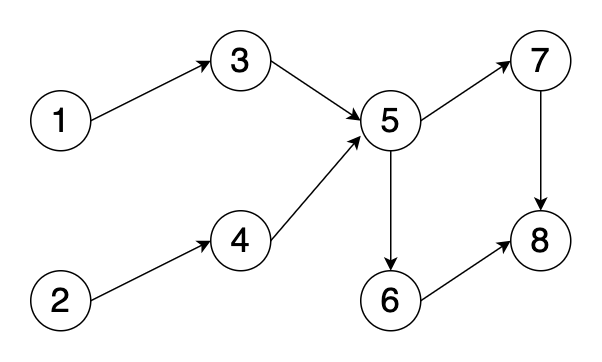

## BFS

第一类：AOV 网的拓扑排序

- 第 207 题，课程表
- 第 210 题，课程表2

第二类：BFS

- 第 200 题，岛屿的数量

## AOV 网络

在图的数据结构中，有向无环图（Directed Acycline Graph，DAG）是一类特殊的有向图。

其中，AOV 网络是 DAG 的典型应用。

在有向图中，用顶点表示活动，用有向边表示活动 a 是活动 b 的前置条件，这种有向图称为用顶点表示活动的网络（Active on Vertices），简称 AOV 网络，如下图所示。

举例例子，上图中的活动 1 就是活动 3 的前置条件，也就是说活动 1 必须完成，活动 3 才可以进行。

对应到现实中，可以类比课程。比如活动 1 表示 C 语言课程，活动 3 表示数据结构。

一个 AOV 网络应该是一个有向无环图，即不应该带有回路，因为如果存在回路，某些活动就会形成相互依赖，无法进行。

**拓扑排序**

一个 AOV 网络中，如果不存在回路，那么所有的活动可以排成一个线性列表，使得每个活动的前驱活动都排在该活动的前面，我们把这种排序称为拓扑排序。

AOV 网的拓扑排序不是唯一的，只要满足上述定义的任一线性序列都称作它的拓扑排序。

例如，序列`[1,2,3,4,5,6,7,8]`和序列`[2,1,4,3,5,7,6,8]`都是上图 AOV 网络的拓扑排序。

那么，如何得到 AOV 网络的拓扑排序呢？可以从每个节点的入度和出度出发。

如果一个节点没有入度，则说明它没有前置依赖，该节点就可以先进入队列。（即，该课程已经完成）

与此同时，将该节点出度所指向的节点的入度减一。（因为，前置依赖已经完成一个）

通过不断地遍历搜索，指导 AOV 网络中不存在入度为零的节点，所形成的队列就是它的拓扑排序。