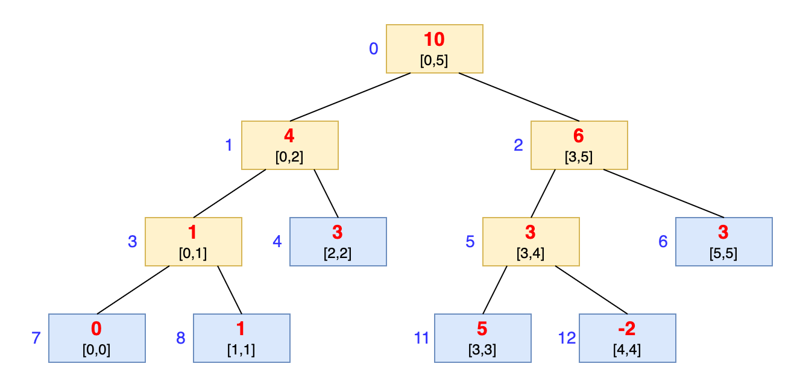
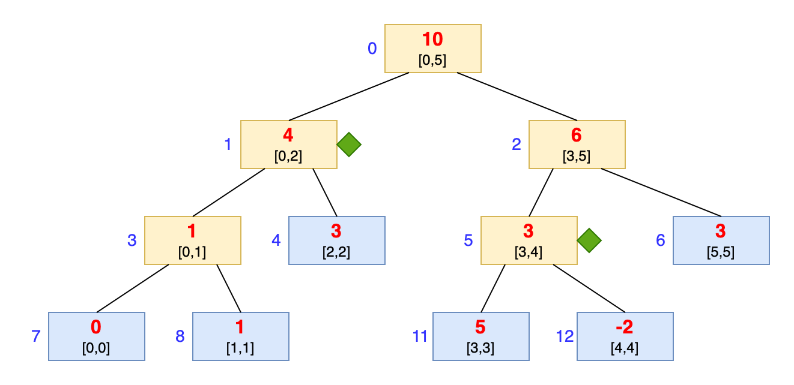
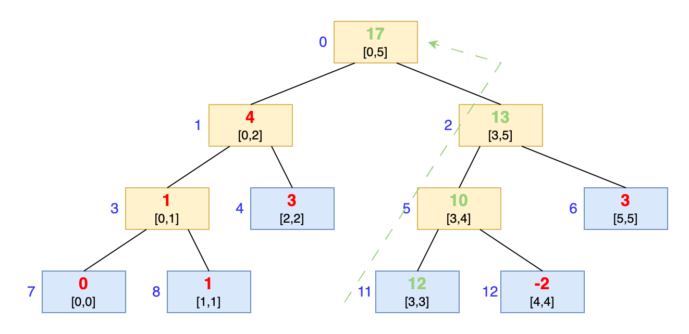
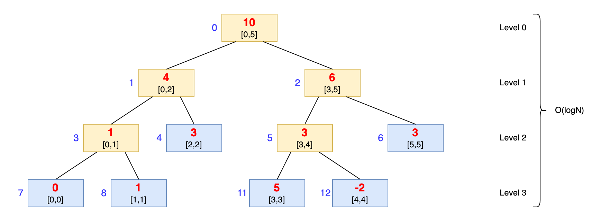

# 线段树

## 1、什么是线段树

线段树 SegmentTree 是一种二叉树形数据结构，1977 年由 Jon Louis Bentley 发明，用来存储区间或线段，并且允许快速查询结构内包含某一点的所有区间。

一个包含 n 个区间的线段树，空间复杂度为`O(n)`，查询的时间复杂度为`O(logn + k)`，其中 k 是符合条件的区间数量。


线段树的结构是一个二叉树，**每个节点都代表一个区间**，节点 N 所代表的区间即为 Int(N)，其需要这些条件：

- 其每个叶子节点，从左到右代表每个单位区间
- 其内部节点（即非叶子节点）是其两个孩子节点的并集
- 每个节点（包含叶子节点）中有一个存储线段的数据结构。



以原始数据 data 为例，构造区间和的线段树如上所示。

```sh
// date 为原始数据，tree 为线段树各节点值
data = [0 1 3 5 -2 3]
tree = [10 4 6 1 3 3 3 0 1 0 0 5 -2 0 0 0 0 0 0 0 0 0 0 0]
```

线段树的结构是二叉树，采用数组的方式进行存储，如果索引 root 为根节点，那么其左节点为`2*root+1`，右节点为`2*root+2`。

线段树的节点有三个信息，其中`[x,y]` 表示区间，即该节点包含这个区间的信息（本例为区间和）,红色数值就是区间和，蓝色数值为节点的树坐标。

图中蓝色节点为叶子节点，即只包含单位区间的值；黄色节点为内部节点，即包含其子节点的并集。


通常，一个节点存储一个或多个合并区间的数据，这样的存储方式便于查询。


## 2、线段树可以做那些事情

许多问题要求我们基于对**可用数据范围或者区间**进行查询，给出结果。这可能是一个繁琐而缓慢的过程，尤其是在查询数量众多且重复的情况下。线段树，作为一个特殊的二叉树，能够让我们以对数时间复杂度有效地处理此类查询。

线段树可用于计算几何和地理信息系统领域。例如，距中心参考点或原点一定距离的空间中可能存在大量的点。假设我们要查找距离原点一定距离范围内的点。一个普通的查找表将需要对所有可能的点或所有可能的距离进行线性扫描；但线段树使我们能够以对数时间实现这一需求，而所需空间也少。


## 3、构造线段树

我们以线段树解决 Range Sum Query 为例，看看如何构造线段树。

假设数据存在大小为 `n` 的 `arr[]` 数组中。

1. 线段树的根通常代表整个数据区间，即 `arr[0: n-1]`。
2. 线段树的叶子节点代表一个范围，仅包含一个元素。因此，叶子节点代表`arr[0], arr[1]...`等等，直到`arr[n-1]`。
3. 线段树的内部节点代表其子节点的合并或者并集结果。
4. 每个子节点可以代表其父结点所表示范围的大约一半。（二分的思想）

从这个过程可以看到，线段树适合递归构造。


我们使用数组 tree 来存储线段树的节点（初始化全零），下标从 0 开始。

- 树的节点下标从 0 开始。`tree[0]` 就是树根。
- `tree[i]`的左右子树，分别存在`tree[2*i+1]`和`tree[2*i+2]`中。
- 用额外的 0 填充 tree


一般使用大小为`4*n` 的数组就可以轻松表示 n 个元素范围的线段树。（Stack Overflow 上分析，详见[这里](https://stackoverflow.com/questions/28470692/how-is-the-memory-of-the-array-of-segment-tree-2-2-ceillogn-1)。


**线段树的构造代码**

```go
type (
	// SegmentTree define
	SegmentTree struct {
		data []int // 存储原始数据
		tree []int // 存储线段树数据
	}
)

func NewSegmentTree() *SegmentTree {
	return &SegmentTree{}
}

func (s *SegmentTree) Init(nums []int) {
	n := len(nums)
	s.data = make([]int, n)
	s.tree = make([]int, 4*n)
	for i := 0; i < n; i++ {
		s.data[i] = nums[i]
	}
	// build segment tree from nums
	left, right := 0, n-1
	s.buildSegmentTree(0, left, right)
}

func (s *SegmentTree) buildSegmentTree(treeIdx int, left, right int) {
	if left == right {
		// the leaf node
		s.tree[treeIdx] = s.data[left]
		return
	}
	mid := left + (right-left)/2
	leftTreeIdx := leftChild(treeIdx)
	rightTreeIdx := rightChild(treeIdx)
	// build left tree with data [left, mid] elem
	s.buildSegmentTree(leftTreeIdx, left, mid)
	// build right tree with data [mid+1, right] elem
	s.buildSegmentTree(rightTreeIdx, mid+1, right)
	s.tree[treeIdx] = s.tree[leftTreeIdx] + s.tree[rightTreeIdx]
}
```


我们以数组`arr = [0, 1, 3, 5, -2, 3]`为例，构造区间和线段树：


线段树构造好以后，tree 里面的数据是：

```go
tree = [10 4 6 1 3 3 3 0 1 0 0 5 -2 0 0 0 0 0 0 0 0 0 0 0]
```


## 4、线段树的查询

线段树的查询方法有两种，一种是直接查询，另一种是懒查询。

### 4.1 直接查询

当查询范围与当前节点表示的范围一致时，直接返回节点值即可。否则，继续深入遍历线段树，找到与节点的一部分完全匹配的节点。

```go
// Query define
// 查询 [left, right] 区间和
func (s *SegmentTree) Query(left, right int) int {
	if len(s.data) > 0 {
		return s.queryInTree(0, 0, len(s.data)-1, left, right)
	}
	return 0
}

// 在以 root 为根的线段树中，[tl, tr] 范围内, 搜索 [left, right] 区间值
// 如果线段树的区间和查询区间一致，那么直接返回线段树的节点
// 否则分左子树，右子树，左右子树三个情况，分别查询
func (s *SegmentTree) queryInTree(root, tl, tr int, left, right int) int {
	// 如果区间一样，直接返回根节点数据
	if left == tl && right == tr {
		return s.tree[root]
	}
	mid := tl + (tr-tl)/2
	leftTree, rightTree := leftChild(root), rightChild(root)
	// query in the right tree
	if left > mid {
		return s.queryInTree(rightTree, mid+1, tr, left, right)
	} else if right <= mid {
		// query in the left tree
		return s.queryInTree(leftTree, tl, mid, left, right)
	}
	lSum := s.queryInTree(leftTree, tl, mid, left, mid)
	rSum := s.queryInTree(rightTree, mid+1, tr, mid+1, right)
	return lSum + rSum
}
```




在上面的示例中，查询`[0,4]`区间的元素和。线段树中没有任何节点完全代表`[2,4]`的范围，但是可以看到，节点1所代表的区间`[0,2]`，节点5所代表的区间`[3,4]`，这两个节点的并集正好构成区间`[0,4]`，那么区间`[0,4]`的元素和，就是节点1和节点5的值之和。

验证一下，原始数组中区间`[0, 4]`的元素之和是：

```sh
0 + 1 + 3 + 5 + (-2) = 7
```

线段树中节点1和节点5的值和为：

```sh
4 + 3 = 7
```

答案正确。


## 5、线段树的更新

### 5.1 单点全量更新

单点更新的过程类似线段树的构建。先更新叶子节点的值，该值与更新后的元素相对应；然后这些更新通过上层节点把影响传递到根节点。

注意：这里的更新是把指定索引的值直接替换掉。

```go
// Update define
// 数值全量更新，即原始数组中下标为 index 的值更新为 val
func (s *SegmentTree) Update(index, val int) {
	if len(s.data) > 0 {
		s.updateInTree(0, 0, len(s.data)-1, index, val)
	}
}

func (s *SegmentTree) updateInTree(root, tl, tr int, index, val int) {
	// find the leaf node, so update its value
	if tl == tr {
		s.tree[root] = val
		s.data[tl] = val
		return
	}

	mid := tl + (tr-tl)/2
	leftTree := leftChild(root)
	rightTree := rightChild(root)
	// if value index is at the right part, then update the right tree
	// otherwise update the left tree
	if index > mid {
		s.updateInTree(rightTree, mid+1, tr, index, val)
	} else if index <= mid {
		s.updateInTree(leftTree, tl, mid, index, val)
	}
	// update the parent's value
	s.tree[root] = s.tree[leftTree] + s.tree[rightTree]
}
```




在这个示例中，我们原始数组中 index 为 3 的值更新为 12，那么整个线段树的更新如图所示，可以看到节点11，节点5，节点2，节点0依次被修改，传到到树根。


## 6、线段树的时间复杂度分析

让我们回顾下线段树的构建过程。

构建过程中我们访问了线段树的每个叶子节点（即原数组中的每个元素）。因此，我们处理大约`2 * n`个节点，这使得构建过程的时间复杂度为`O(n)`。

对于每一次递归更新的过程都丢弃一半的区间范围，以到达树的叶子节点，类似二分搜索，只需要对数时间。

叶子更新后，开始返回更新其父节点，这个时间与线段树的高度成线性关系。



`4*n`个节点可以确保将线段树构建为完整的二叉树，从而树的高度为**以2为底，4n+1**的对数。

线段树查询和更新，时间复杂度都为`O(logN)`。


## 7、常见题型

第一类：区间和，经典的线段树解法

第 303 题：区域和检索，数组不可变，【直接构造线段树，查询方法即可】

第 307 题：区域和检索，数组可修改