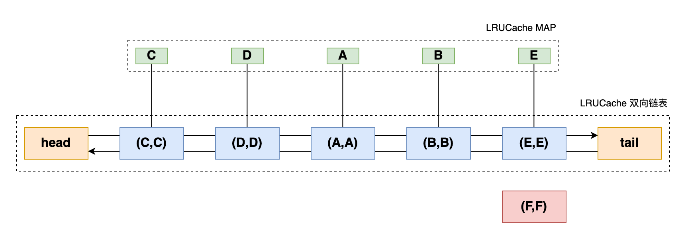

## LRU缓存

LRU 是 Least Recently Used 的缩写，即最近最少使用，是数据缓冲淘汰的一种常见机制，重点在于理解**最近**和**最少**两个关键词。

- 最近。即最近访问过的数据要留在缓冲区内。
- 最少。这里的最少并不是值总的访问次数最少，而是很久没有访问，如果超出缓冲容量，那么可以删除。

比如容量为 2 的一个缓冲序列，历史上数据 A 被访问了 100 次，数据 B 被访问了 2 次，但最后一次访问是访问数据 B，那么当新的数据 C 需要缓存的时候，新插入的数据 C 会踢掉数据 A，而不是数据 B。


所以，从数据结构来讲，LRU 应该是一个链表，按访问时间，越是最近访问的，越靠近链表的头部。


LRU 主要有两个方法`Get`和`Put`，要求`O(1)`的时间复杂度，那么考虑双向链表来实现。具体为：

- 用 head 和 tail 做头、尾的伪节点，便于做头部插入，尾部删除
- 利用 map 辅助存储

链表的节点既要存储 key，也要储存 value。这是因为当超过缓存容量时，要从双向链表中删除数据。在双向链表中删除淘汰的 value，在 map 中删除淘汰出去的 value 对应的 key。


### 1、结构定义

```go
type (
	// CacheNode define
	// key, val 存储缓存的键值对
	// pre, next 指向双向链表的前驱和后驱节点
	CacheNode struct {
		key, val  int
		pre, next *CacheNode
	}

	// LRUCache define
	LRUCache struct {
		size, capacity int
		head, tail     *CacheNode
		cache          map[int]*CacheNode
	}
)
```


### 2、初始化

```go
// NewLRUCache define
func NewLRUCache(cap int) *LRUCache {
	ca := &LRUCache{
		size:     0,
		capacity: cap,
		head:     &CacheNode{0, 0, nil, nil},
		tail:     &CacheNode{0, 0, nil, nil},
		cache:    make(map[int]*CacheNode, cap),
	}
	ca.head.next = ca.tail
	ca.tail.pre = ca.head
	return ca
}
```

初始化的时候，创建两个伪节点 head 和 tail，便于在头部插入和尾部删除。

```go
// add node to head
func (l *LRUCache) addToHead(node *CacheNode) {
	node.pre = l.head
	node.next = l.head.next

	l.head.next.pre = node
	l.head.next = node
}

// remove and return the tail node
func (l *LRUCache) removeTail() *CacheNode {
	node := l.tail.pre
	l.removeNode(node)
	return node
}
```


### 3、查询

```go
// Get define
func (l *LRUCache) Get(key int) int {
	node, ok := l.cache[key]
	if !ok {
		return -1
	}
	l.moveToHead(node)
	return node.val
}
```


### 4、创建和更新

```go
// Put define
func (l *LRUCache) Put(key, value int) {
	if node, ok := l.cache[key]; ok {
		// update node and move to head
		node.val = value
		l.moveToHead(node)
		return
	}

	// add node
	node := &CacheNode{key: key, val: value}
	l.cache[key] = node
	l.addToHead(node)
	l.size++
	if l.size > l.capacity {
		// remote tail
		rmd := l.removeTail()
		delete(l.cache, rmd.key)
		l.size--
	}
}
```

LRUCache 的创建和更新，都是`Put`函数。先从 map 中查，如果存在直接更新，并把该节点移到双向链表的头部。

如果不存在，直接创建，然后在移到双向链表的头部。

再判断已经缓存的数据量是否超过容量，如果超过，直接从尾部开始删除，并删除 map 中的数据。


总结下，LRU 是一个由 map 和 双向链表组成的数据结构。map 中 key 对应的 value 是双向链表的节点。双向链表中存储具体的 key-value 信息。双向链表表头用于更新缓存，表尾用于淘汰缓存。


