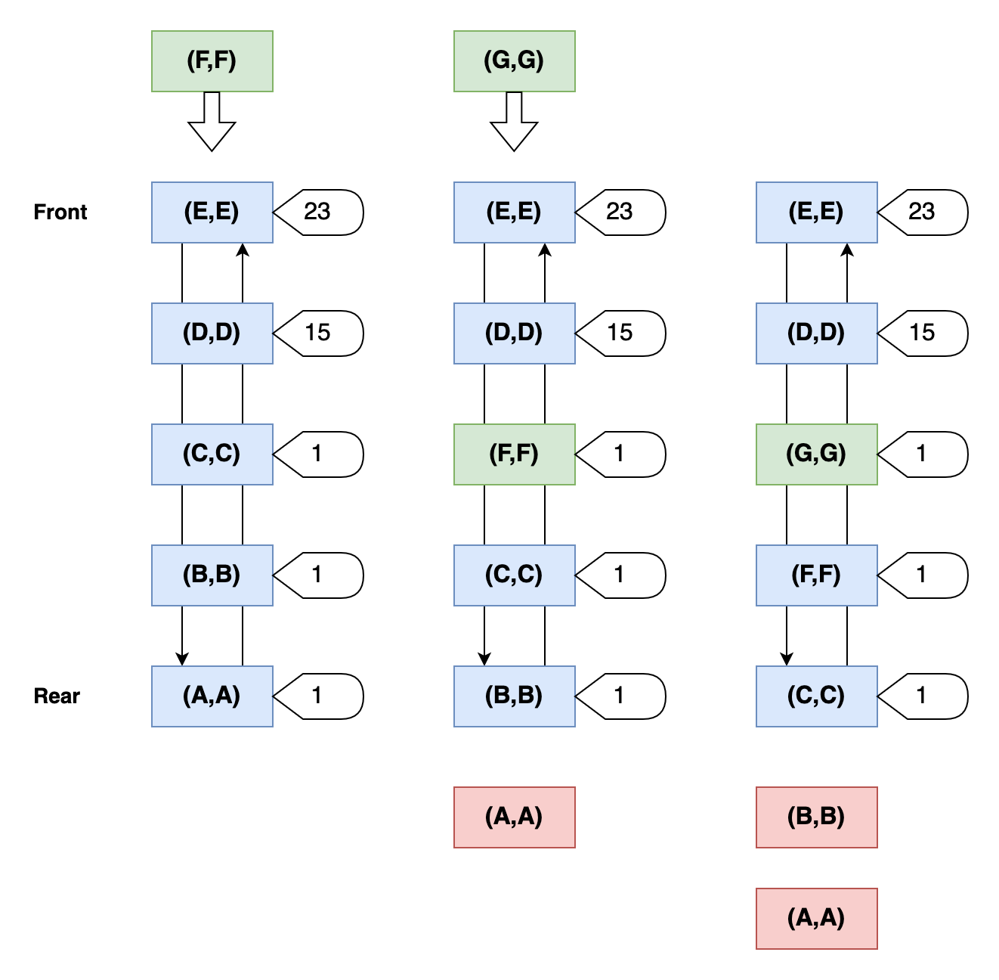
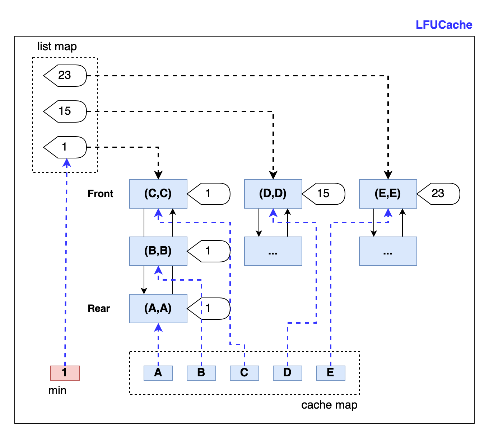

## LFU缓存

### 1、什么是LFU

LFU 是 Least Frequently Used 的缩写，即最不经常、最少使用，也是一种常见缓存淘汰机制，选择访问计数器最小的页面进行淘汰。

所以，对每个缓存数据都带有一个访问计数器。


根据 LFU 的策略，每访问一次都需要更新该数据的访问计数器，并把数据移到访问计数器从大到小的位置。

举个例子，一个容量为 3 个缓存器，当前缓存器中的数据及其计数器分别是：

```sh
数据 A 计数器为23
数据 B 计数器为12
数据 C 计数器为12
```

插入数据 B，发现缓存中有 B，那么 B 的计数器加1，并移到按数据计数器排序的位置；

插入数据 D，发现缓存中没有 B，插入 D 将导致容量超过，那么计数器为12的数据 C，会被淘汰；数据 D 放在数据 B 的后面，计数器为1。

此时，缓存器中的数据及其计数器分别是：

```sh
数据 A 计数器为23
数据 B 计数器为13
数据 D 计数器为1
```


### 2、LFU的淘汰机制

这里有一个 LRU 特别的地方。如果淘汰的数据有多个相同的计数器，那么选择最靠近尾部的数据，即从尾部删除。



比如上图中数据 A、B、C的访问次数相同，都是 1，新插入的数据 F 不在缓存中，那么要淘汰 A，并把 F 放到数据 C 的前面。也就是说**相同访问次数，按照新旧顺序排列，淘汰最旧的数据。**

所以，可见**LFU 更新和插入可以发生在链表的任意位置，删除都发生在表尾。**


同样的，LFU 同样要求查询尽量高效，`O(1)`查询。那么，我们可以选择 map 辅助查询，选用双向链表存储 key-value。因为，LFU 需要记录访问次数，所以每个节点除了存储key, value，还要存储 frequency 访问次数。


### 3、按频次排序？

前面讲到过，相同频次的数据按先后时间排序。那么不同频次的数据，如何排序呢？

如果你开始考虑排序算法，那么你的思考方向就偏离了最佳答案。排序至少`O(logN)`。

回过头来看 LFU 的原理，你会发现它**只关心最小频次，其他频次之间的顺序不需要排序。**

因为，数据存在的时候，直接更新频次就好；只有数据不存在，新插入数据导致旧数据删除的时候，才会看数据的频次，且只看最小频次的数据。


我们可以选择 min 变量保存最小频次，淘汰时读取这个值找到要删除的数据。

相同频次的数据，按先后顺序排序，这个特点双向表插入动作已经体现了。

如何把相同频次的数据组织在一起呢？还是用 map，map 的 key 为访问频次，value 为该频次下双向链表。

当超过缓存容量时，需要删除，先找到最小频次 min，再从 map 中找到 min 对应的双向链表，从该链表的表尾删除一个数据即可，这就解决了 LFU 的删除操作。


### 4、LFU 的实现

有了上面的介绍，我们就可以定义 LFU 的数据结构：

```go
type (
	// LFUNode define
	LFUNode struct {
		key, val  int
		frequency int
		pre, next *LFUNode
	}
	// LFUList define
	LFUList struct {
		size       int
		head, tail *LFUNode
	}
	// LFUCache define
	LFUCache struct {
		cache    map[int]*LFUNode // key is node key
		list     map[int]*LFUList // key is frequency
		capacity int
		min      int
	}
)
```

`LFUNode`存储具体的 key-value 信息，同时 frequency 记录访问频次。

`LFUList`是一个双向链表，相同频次的 `LFUNode`会组织到同一个双向链表中。

`LFUCache`是主结构，包含两个 map，分别记录节点和双向链表，capacity 和 min 两个变量。


LFUCache 的 Get 操作，涉及 frequency 的更新和 map 的调整。具体为：先在 cache map 中通过 key 查到节点信息，根据节点的 frequency 在 list map 中找到该 frequency 的双向链表，删除该节点。删除后，frequency 递增，再次从 list map 中查找新的 frequency 所在的双向链表，如果不存在，直接创建一个，然后在双向链表的表头插入该节点。

最后记得更新 min 值。如果老的 frequency 等于 min，那么就需要进一步判断 list map 中是否存在 min（即最小的frequency）对应的双向链表。如果不存在，或者存在，但双向链表为空，那么都需要更新 min 值。

这是因为 Get 操作会把节点从 frequency 对应的双向链表，移到 frequency+1 对应的双向链表。如果移到导致老的 frequency 双向链表为空，那么 min 就需要更新为 frequency。

```go
func (l *LFUCache) Get(key int) int {
	node, ok := l.cache[key]
	if !ok {
		return -1
	}
	// first remote from the old frequency, then move to the new double list
	l.list[node.frequency].removeNode(node)
	node.frequency++
	if _, ok = l.list[node.frequency]; !ok {
		l.list[node.frequency] = NewLFUList()
	}
	oldList := l.list[node.frequency]
	oldList.addToFront(node)

	// if l.min is empty update
	if node.frequency-1 == l.min {
		if minList, ok := l.list[l.min]; !ok || minList.isEmpty() {
			l.min = node.frequency
		}
	}
	return node.val
}
```


LFUCache 的 Put 操作会稍微复杂一些。

先在 cache map 中查询 key 是否存在，如果存在，直接更新 value 和 frequency 值即可，更新 frequency 值与Get中的逻辑一样，直接复用。

如果不存在，就需要进行插入。插入前，先判断是否满了，如果装满，根据 min 找到双向链表，表尾删除节点，同时在 cache map 也要删除该节点。

因为新插入的数据访问次数为1，所以 min 也要更新为1。新建节点，插入两个  map 即可。

```go
func (l *LFUCache) Put(key, value int) {
	if l.capacity == 0 {
		return
	}
	// update node's frequency if exist
	if node, ok := l.cache[key]; ok {
		node.val = value
		// 处理过程与 get 一样，直接复用
		l.Get(key)
		return
	}

	// not exist
	// 如果不存在且缓冲满了，需要删除
	if l.capacity == len(l.cache) {
		minList := l.list[l.min]
		rmd := minList.removeFromRear()
		delete(l.cache, rmd.key)
	}

	// new node, insert to map
	node := &LFUNode{key: key, val: value, frequency: 1}
	// the min change to 1, once create a new node
	l.min = 1
	if _, ok := l.list[l.min]; !ok {
		l.list[l.min] = NewLFUList()
	}
	oldList := l.list[l.min]
	oldList.addToFront(node)
	// insert node to all cache
	l.cache[key] = node
}
```


总结下，LFU 是由两个 map 和一个 min 变量组成的数据结构。

一个 map 的 key 存储的是访问次数，对应的 value 是一个个双向链表，双向链表的作用是在相同频次的情况下，淘汰删除表尾的数据；而数据更新（或者新建）则从表头插入。

另一个 map 中 key 对应的 value 就是双向链表的节点，即实际存储的缓存数据。这里的双向链表节点比 LRU 多储存了一个访问次数的值，即 key-value-frequency 元组。

这里的双向链表的作用与 LRU 类似，既可以根据 map 中 key 更新双向链表节点的 value 和 frequency，也可以根据双向链表节点中的 key 和 frequency 反向更新 map 中的对应关系。


