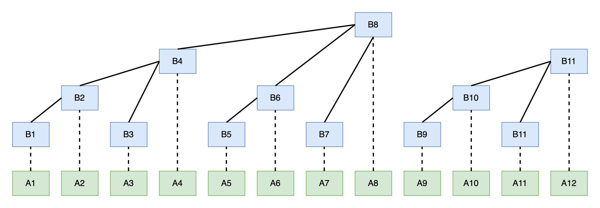
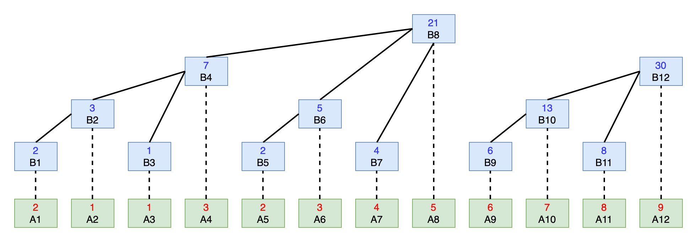
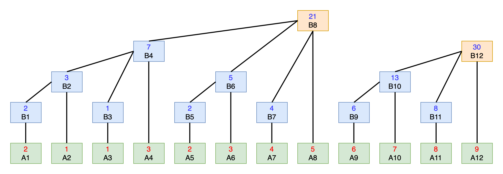
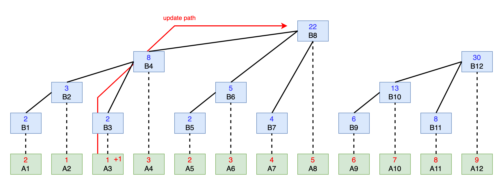

# Binary Indexed Tree \[二叉索引树\]

[TOC]

## 1、结构介绍

二叉索引树，Binary Indexed Tree，又名树状数组，或者Fenwick Tree，因为本算法由Fenwick创造。


## 2、问题定义

给定一个数组array[0....n-1]，实现两个函数：1）求取前i项和；2）更新第i项值。

分析：

一个比较简单的解法就是通过循环累计求和（需要`O(N)`时间复杂度），根据下标更新值（需要`O(1)`时间复杂度）。

另一种解法是前缀和，创建一个前 n 项和数组，这样求和需要O(1)时间，更新需要O(n)时间。

而使用BIT数据结构，可以在O(Logn)时间内进行求和操作和更新操作。下面具体介绍一下。


## 3、树形数组概念



说明：图中实线表示数组 B 中节点之间的关系；虚线表示两个数组下标对齐。

图中数组 A 为原始数组，B 为树形数组。树形数组的底层结构是数组，但每个节点有树的关系。如图所示，树形数组中父子节点具有这样的关系：

```sh
// parent, son 均为下标，k 为 son 下标对应二进制末尾0的个数
parent = son + 2^k
```

在 B 数组中，B4，B6，B7 都是 B8 的子节点。因为

```sh
# 4 的二进制是 0b100
4 + 2^2 = 8
# 6 的二进制是 0b110
6 + 2^1 = 8
# 7 的二进制是 0b111
7 + 2^0 = 8
```

所以，B4，B6，B7 的父结点都是 B8。

从另一个角度看，`2^k`也是 son 下标的二进制表示形式中从尾部数第一个 1 所代表的数值。

```go
// 4 = 0b100
4 + 4 = 8
// 6 = 0b110
6 + 2 = 8
// 7 = 0b111
7 + 1 = 8
```


## 4、节点的意义

树形数组可用于求区间和，下面以求区间和为例。

在树形数组中，所有奇数下标的节点都叶子节点，即单点，没有子节点，那么它存储的就是原始数组中的值。比如，图中的 B1，B3，B5，B7，B9 都是叶子节点，分别存储 A1，A3，A5，A7，A9 的值。

所有的偶数下标的节点都是父节点。父节点存储的是区间和。比如，B4 存储的就是 B2，B3，A4 的和，开展之后就是：

```sh
B4 = B2 + B3 + A4 = A1 + A2 + A3 + A4
```

这个区间的左边界是该父节点最左边的叶子节点，右边界就是自己的下标。对 B 数组下标按个计算如下：

```sh
B1 = A1
B2 = B1 + A2 = A1 + A2
B3 = A3
B4 = B2 + B3 + A4 = A1 + A2 + A3 + A4
B5 = A5
B6 = B5 + A6 = A5 + A6
B7 = A7
B8 = B4 + B6 + B7 + A8 = A1 + A2 + A3 + A4 + A5 + A6 + A7
```

通过数学归纳法可以得出，左边界的下标一定是 `i - 2^k + 1`，其中 i 为父结点的下标，k 为 i 对应二进制中末尾0 的个数。

所以 B 数组每个节点的值可以表示为：

```go
// j = i - 2^k + 1
// k 为 i 二进制表现形式中末尾0的个数
B[i] = sum(j, i) of A
```

所以，可知，**数组B每个节点的值是数组A部分节点的和**。


### 5、树形数组初始化

有了上面的介绍，我们就从原始数组 A 初始化树形数组B，代码如下：

```go
type (
	// BinaryIndexedTree define
	BinaryIndexedTree struct {
		capacity int
		tree     []int
	}
)

// NewBinaryIndexedTree define
func NewBinaryIndexedTree(arr []int) *BinaryIndexedTree {
	n := len(arr)
	b := &BinaryIndexedTree{
		capacity: n + 1,
		tree:     make([]int, n+1), // 为了计算方便，初始化为n+1
	}
	for i := 1; i <= n; i++ {
		b.tree[i] = arr[i-1]
		for j := i - 2; j >= i-lowbit(i); j-- {
			b.tree[i] += arr[j]
		}
	}
	return b
}

// 返回 x 二进制形式中，末尾最后一个1所代表的数值，即 2^k
// k 为 x 二进制中末尾零的的个数
func lowbit(x int) int {
	return x & -x
}
```

初始化以后，原始数组 A 和树形数组 B 的对应关系如下：




### 5、查询操作

**树形数组 B 可以查询原数组 A 区间`[1, i]`的和**。

按照数组B中节点的定义，以及与A数组的关系，可以得知：

```go
Query(i) = A1 + A2 + ... + Ai
= A1 + A2 + ... + A(i-2^k) + A(i-2^k+1) + ... + Ai
= Query(i-2^k) + Bi
= Query(i-lowbit(i)) + Bi
```

所以，对数组A的区间和查询，等价于对数组B中某些节点求和。

对数组B求和的时候，`i-lowbit(i)` 不断地将 i 二进制中末尾的 1 去掉，进行递归求和。

对于任意的数值 i，其最多有`log(i)`个1，所以原本对数组A求区间和所需要的时间复杂度为`O(N)`，可以转变为对树形数组B求和，其时间复杂度为`O(logN)`。

这就是树形数组在解决区间和问题上的优势。

具体查询代码如下：

```go
// Query define
// 求区间和，返回原始数组中[0, index] 的区间和
func (b *BinaryIndexedTree) Query(index int) int {
	sum := 0
	for index > 1 {
		sum += b.tree[index]
		index -= lowbit(index)
	}
	return sum
}
```


既然能够高效地查询从数组头开始的区间和，那么任意区间的和也可求解。

```go
// RangeSum define
// 对任意区间求和，返回A[start, end]区间和
func (b *BinaryIndexedTree) RangeSum(start, end int) int {
	s1 := b.Query(start - 1)
	s2 := b.Query(end)
	return s2 - s1
}
```


查询操作如此高效，也得益于这样一个事实：**任意正整数都可以表示为多个2的幂次方之和**。

比如，12 = 8 + 4，要想得到原始数组A中前 12 项的和，那么只需要将 B12 + B8 即可。B8 存储了前8项的和，B12 存储了后4项的和。




### 6、更新操作（增量更新）

树形数组 B 中父子节点的关系是`parnet = son + 2^k`，那么可以通过这个公式，从叶子节点不断向上递推，知直到最大的父结点为止。

祖先节点最多`logN`个，所以更新操作的时间复杂度为`O(logN)`。

**注意，这里指的是增量更新，即某个节点增加或减少某个值**

```go
// Add define
// 增量更新，即对原始数组A index下标的值 增加 val
func (b *BinaryIndexedTree) Add(index, val int) {
	// parent = son + 2^k
	for index <= b.capacity {
		b.tree[index] += val
		index += lowbit(index)
	}
}
```




### 7、不同场景下树形数组的功能

根据节点维护数据的含义不同，树形数组可以提供不同的功能来满足各种区间和问题。


**第一类：单点更新+区间求和**

这是树形数组最典型的场景。单点更新，一般是增量更新，直接 `add(index, val)`即可，如果是全量更新，树形数组结构中多维护一个原始数据，全量更新可以转化为增量更新。

区间求和，直接两次查询即可。求`[left, right]`区间和，等于：

```go
query(right) - query(left-1)
```

这类题目有：

- 第 307 题：区域和检索，数组可修改。


**第二类：区间增减+单点查询**

这类情况可用差分数组，区间更新，只修改区间两头的值即可；

单点查询，就变成了对差分数组的前缀和。
