# 字典树 Trie

## 定义

Trie，字典树（digital tree），也叫前缀树（prefix tree），顾名思义，就是像字典一样的树，像字典一样可以快速查找一个单词是不是在字典中。

字典树是一种多路树数据结构，用于在字母表上存储字符串。它可以存储大量的字符串，并且可以有效地完成模式匹配。


我们以单词为例，介绍下字典树。

如下图所示，字典树有一个根节点，从根节点出发，依次存储单词的一个字符；如果某个节点正好是单词的结尾，那么标记为单词节点，否则为普通节点。



一个简单的字典树节点可如下表示：

```go
const ALPHABET_SIZE = 26

// TrieNode define
type TrieNode struct {
	child [ALPHABET_SIZE]*TrieNode
	// isEndOfWord is true if the node represents
	// end of a word
	isEndOfWord bool
}
```

以单词为例，每个字符的下一个字符都有 26 中可能，所以 child 用一个大小为 26 的数组，`isEndOfWord`表当前节点是否是单词。


## 插入操作

向字典树中插入一个单词 key，可使用下面这种方法：

1. 把 key 的每个字符充当 child 的索引，如果字符不存在或者是已有字符的延伸，那么构建新的节点，并把最后一个节点标记为单词
2. 如果字符已经在字典中存在，找到最后一个节点，标记为单词即可

```go
// InsertKey define
// If not present, inserts key into trie
// If the key is prefix of trie node, just
// marks leaf node
func (t *TrieNode) InsertKey(key string) {
	n := len(key)
	if n <= 0 {
		return
	}
	cur := t
	for i := 0; i < n; i++ {
		idx := key[i] - 'a'
		if cur.child[idx] == nil {
			cur.child[idx] = NewTrieNode()
		}
		cur = cur.child[idx]
	}
	cur.isEndOfWord = true
}
```

从插入操作可以看出，**key 越长，字典树的深度越大**。


## 查询操作

查询一个单词 key 是否在字典树中，可以这样做：

从根节点开始，**顺次**查找 child，如果 child 为空，表示不存在；不为空，就继续查找。

直到最后一个节点，返回该节点是否为单词的标记位即可。

```go
// SearchKey define
// Returns true if key presents in trie, else
// false
func (t *TrieNode) SearchKey(key string) bool {
	n := len(key)
	if n == 0 {
		return false
	}
	cur := t
	for i := 0; i < n; i++ {
		idx := key[i] - 'a'
		if cur.child[idx] == nil {
			return false
		}
		cur = cur.child[idx]
	}
	return cur.isEndOfWord
}
```


## 删除操作

从字典树中删除 key，我们可以使用递归的方式进行删除，需要考虑一下几种情况：

- 如果 key 不在字典树中，那么字典树不应该被修改。
- 如果 key 在字典树中唯一，或者说这个 key 也不是其他更长 key 的前缀，那么应该删除所有的节点。
- 如果 key 是另一个更长 key 的前缀，那么需要修改单词节点的标记。
- 如果 key 中包含另一个 key 的前缀，那么只需要删除非公共前缀的部分。

```go
// DeleteKey define
func (t *TrieNode) DeleteKey(key string) {
	n := len(key)
	if n == 0 {
		return
	}
	// dfs
	var dfs func(root *TrieNode, key string, depth int) *TrieNode
	dfs = func(root *TrieNode, key string, depth int) *TrieNode {
		// if tree is empty
		if root == nil {
			return root
		}
		// process the last character of key
		if depth == len(key) {
			// unmark
			// this node is no more end of word after delete of given key
			if root.isEndOfWord {
				root.isEndOfWord = false
			}
			// if the given key is not prefix of any other word
			if root.isEmpty() {
				root = nil
			}
			return root
		}
		// if not last character, recur for the child
		idx := key[depth] - 'a'
		// if not find key, just return
		if root.child[idx] == nil {
			return root
		}
		// recur the child
		root.child[idx] = dfs(root.child[idx], key, depth+1)
		// if current node is not the prefix of given key, remote it
		if root.isEmpty() && !root.isEndOfWord {
			root = nil
		}
		return root
	}
	dfs(t, key, 0)
}
```


## 字典树可做那些事情

字典树可以用来做很多事请。

第一个：**词频统计**。

如果有大量的单词，想要统计每个单词出现的次数。当然哈希表可以做，但是如果内存有限呢？

用字典树来做可以压缩空间，因为公共前缀都是一个节点来表示。


第二个：**前缀匹配**


## 字典树的优势

通过上面的介绍，可以发现字典树具有以下优势：

- 因为字典树使用了公共的，相同的前缀，所以查找更快。查找速度取决于字典树的高度。
- 如果存在大量的，短的字符串，字典树所使用的内存空间更少。因为 key 之间的前缀可复用。
- 前缀匹配模式，可查找。


如何拿字典树和哈希表相比的话？

1. 与不完美的哈希表相比，在最坏的情况下，字典树的查找更快。
2. 字典树中，不同的 key 不存在哈希冲突。
3. 字典树中，如果单个 key 可以跟多个值关联，那么它就类似哈希表中的桶。
4. 字典树中，没有哈希函数。
5. 有时，从字典树中查找比哈希慢很多。
6. 以字符串作为 key，有时候很复杂。比如当浮点数变成字符串在字典树中插入和查找，会很复杂。
7. 通常情况下，字典树比哈希表占用的内存空间更多。


