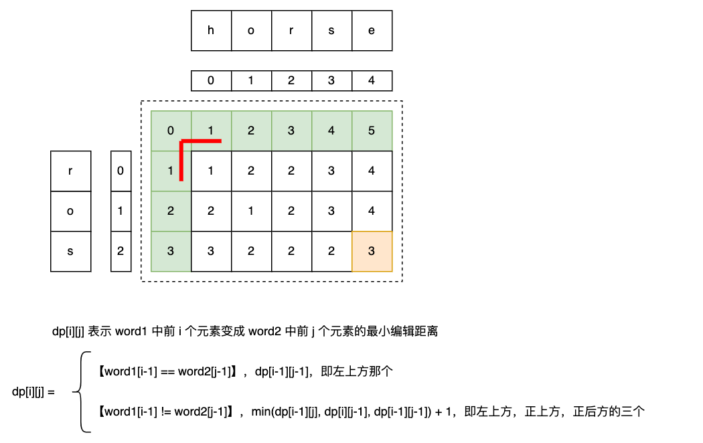

## 72 编辑距离-中等

题目：

给你两个单词 word1 和 word2， 请返回将 word1 转换成 word2 所使用的最少操作数  。

你可以对一个单词进行如下三种操作：

插入一个字符
删除一个字符
替换一个字符


分析：

```go
// date 2023/11/07
func minDistance(word1 string, word2 string) int {
    m, n := len(word1), len(word2)
    dp := make([][]int, m+1)
    // dp[i][j] 表示将 word1[0...i-1] 变成 word2[0...j-1] 所需要的最小编辑数
    for i := 0; i <= m; i++ {
        dp[i] = make([]int, n+1)
        dp[i][0] = i  // j = 0, word2 is empty, delete all word1 elem
    }
    for j := 0; j <= n; j++ {
        dp[0][j] = j  // i = 0, word1 is empty, insert all elem to word1
    }

    for i := 1; i <= m; i++ {
        for j := 1; j <= n; j++ {
            if word1[i-1] == word2[j-1] {
                dp[i][j] = dp[i-1][j-1]
            } else {
                dp[i][j] = min(min(dp[i-1][j], dp[i][j-1]), dp[i-1][j-1]) + 1
                // dp[i-1][j] delete 1 elem in word1
                // dp[i][j-1] insert 1 elem to word2 等价于从 word1 删除 1 个
                // dp[i-1][j-1] replace 1 elem of word1
            }
        }
    }

    return dp[m][n]
}

// word1[0...i-1] -> word2[0....j] = dp[i-1][j]
// word1[0.....i] -> word2[0....j] = dp[i][j]
// 在 dp[i-1][j] 已知的情况下，word1 中 删除 word1[i] 即可
// dp[i][j] = dp[i-1][j], delete 1 elem of word1

func min(x, y int) int {
    if x < y {
        return x
    }
    return y
}
```


