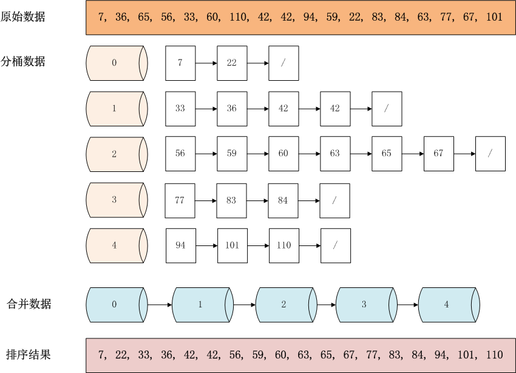

## 桶排序（bucket sort）

桶排序是计数排序的升级版。

其思想是通过映射函数将输入的 N 个数据均匀地分配到 K 个桶中，如果桶内有冲突，再对桶内元素进行排序。



为了使桶排序更加高效，我们需要做到两点：

1）在额外空间充足的情况下，尽可能增大桶的数量

2）映射函数要能够将 N 个数据均匀地分配到 K 个桶中


什么时候最快？

当输入的数据可以均匀地分配到每一个桶中。

什么时候最慢？

当输入的数据哈希到同一个桶中。


```go
// 07 bucket sort
func bucketSort(nums []int) []int {
	n := len(nums)
	if n < 2 {
		return nums
	}
	// find the min/max value
	minV, maxV := nums[0], nums[0]
	for _, v := range nums {
		if v < minV {
			minV = v
		}
		if v > maxV {
			maxV = v
		}
	}

	// bucket init
	bucketSize := 2
	bucket := make([][]int, (maxV-minV)/bucketSize+1)
	for i := 0; i < len(bucket); i++ {
		bucket[i] = make([]int, 0, 4)
	}

	// put elem to bucket
	// hash function  = (nums[i] - minV) / bucketSize
	for _, v := range nums {
		bIdx := (v - minV) / bucketSize
		bucket[bIdx] = append(bucket[bIdx], v)
	}

	// sort bucket and put elem to nums
	idx := 0
	for _, buck := range bucket {
		if len(buck) != 0 {
			insertSort(buck)
			for _, v := range buck {
				nums[idx] = v
				idx++
			}
		}
	}
	return nums
}

func insertSortForBucket(nums []int) []int {
	n := len(nums)
	if n < 2 {
		return nums
	}
	for i := 1; i < n; i++ {
		v := nums[i]
		j := i - 1
		for j >= 0 && nums[j] > v {
			j--
		}
		nums[j+1] = v
	}
	return nums
}
```

