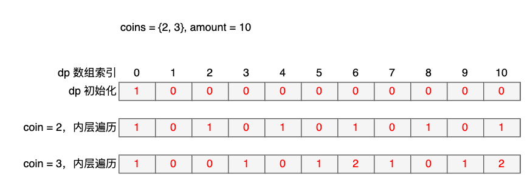

## 518 零钱兑换2-中等

题目：

给你一个整数数组 `coins` 表示不同面额的硬币，另给一个整数 `amount` 表示总金额。

请你计算并返回可以凑成总金额的硬币组合数。如果任何硬币组合都无法凑出总金额，返回 `0` 。

假设每一种面额的硬币有无限个。 

题目数据保证结果符合 32 位带符号整数。


分析：

典型的动态规划题目。我们设 dp[i] 表示总金额为 i 所对应的组合数，那么对于每一种 coin，有如下递推公式：

```
dp[i] = dp[i] + dp[i-coin]
```

该公式表示，当 coin 固定时，dp[i] 和 dp[i-coin] 有同等个数的解。

以下面的图为例，coin = 3，i = 6 为例，coin 提供一个解，再加上 coin = 2 所提供的 i = 6 的一个解，所以 dp[6] = 2。

所以，整个解法的代码里，外层循环是 coins，对特定coin，求所有 amount 下的解，包含两部分：

1. `amount` 是当前 `coin` 整数倍的，肯定提供一个解
2. 在之前解的基础上，amount-coin 又提供一种解

所以递推公式:

```
dp[i] = dp[i] + dp[i-coin]
等号左边的 dp[i] 是 当前 coin 下总组合数
等号右边的 dp[i] 是 历史上其他 coin 所提供的组合数
等号右边的 dp[i-coin] 是 以当前 coin 为步长所形成的解
```


```go
// date 2023/11/09
func change(amount int, coins []int) int {
    dp := make([]int, amount+1)
    dp[0] = 1
    for _, coin := range coins {
        for i := 1; i <= amount; i++ {
            if i < coin {
                continue
            }
            dp[i] += dp[i-coin]
        }
    }
    return dp[amount]
}
```




---

## 扩展

该问题跟爬楼梯类似，但是有本质区别。

爬楼梯是求**排列数**，该问题是求**组合数**。

**排列数** 是指序列中元素的顺序不同，即为1种解。

但是**组合数**是说序列中元素的种类和数量一样，视为1种解。

举个例子，还是以 coins = {2, 3} 为例，目标是 5。

如果当做爬楼梯来解，那么表示你可以迈2个或3个台阶，求到达第 5 个台阶有多少总走法。

很显然有两种，分别是（2，3）和（3，2），因为先走 2 步，后走 3 步，和先走 3 步，后走 2 步，是看做 2 个解。


但在零钱兑换里面，就不是这样。2和3，各取一个组合 5，被视为 1 种解。

再看两个问题的解法，就会发现两层循环的区别：

排列数的解法中，总目标在外层循环体；组合数的解法中，总目标在内层循环。